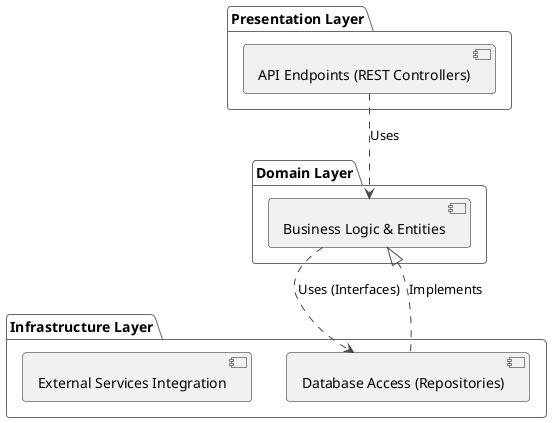
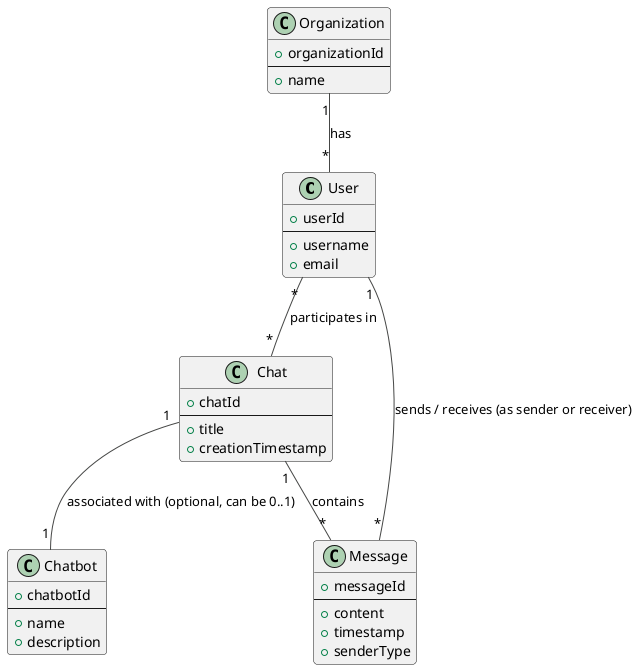

# Architectural Overview

This document outlines the high-level architecture of the Spring Boot application. The application follows a layered architectural pattern, separating concerns into three distinct layers: Presentation, Domain, and Infrastructure.

## Layered Architecture

### 1. Presentation Layer

*   **Responsibilities:** This layer is responsible for handling all user interactions and external API requests. It receives incoming requests, validates them, and delegates the processing to the Domain layer. It then formats the responses from the Domain layer and sends them back to the client.
*   **Technologies:** Typically implemented using Spring MVC (REST controllers) for handling HTTP requests, and potentially templating engines or frontend frameworks if serving web UIs directly.

### 2. Domain Layer

*   **Responsibilities:** This is the heart of the application and contains the core business logic, entities, and use cases. It is independent of the presentation and infrastructure layers. It defines the rules and operations that govern the application's behavior.
*   **Key Components:**
    *   **Entities:** Represent core business objects (e.g., User, Chat, Message).
    *   **Services:** Orchestrate business logic and use cases.
    *   **Repositories (Interfaces):** Define contracts for data access, implemented by the Infrastructure layer.

### 3. Infrastructure Layer

*   **Responsibilities:** This layer deals with external concerns and technical details. It provides implementations for interfaces defined in the Domain layer (e.g., repositories). It also handles interactions with databases, messaging queues, external services, and other infrastructure components.
*   **Technologies:** Spring Data JPA for database interaction, Spring AMQP for messaging, clients for third-party APIs, etc.

## Dependencies

*   The **Presentation** layer depends on the **Domain** layer.
*   The **Domain** layer depends on the **Infrastructure** layer (specifically, on the interfaces defined in the Domain layer and implemented in the Infrastructure layer).
*   The **Infrastructure** layer implements interfaces from the Domain layer and interacts with external systems.

This separation of concerns promotes modularity, testability, and maintainability. Changes in one layer should have minimal impact on other layers, as long as the contracts (interfaces) between them are maintained.

## PlantUML Diagrams

### Component Diagram

### Core Domain Entities Class Diagram

