# Domain Layer Documentation

This document provides a detailed overview of the Domain Layer of the Snappy Server application. It includes descriptions of core domain entities and key use cases, illustrated with PlantUML diagrams.

## Core Domain Entities

The Domain Layer is built around a set of core entities that represent the fundamental concepts of the application.

---

### User

The `User` entity represents an individual user within the Snappy Server application. Users can communicate with each other, belong to organizations, and interact with chatbots. This entity also implements Spring Security's `UserDetails` interface to integrate with authentication mechanisms.

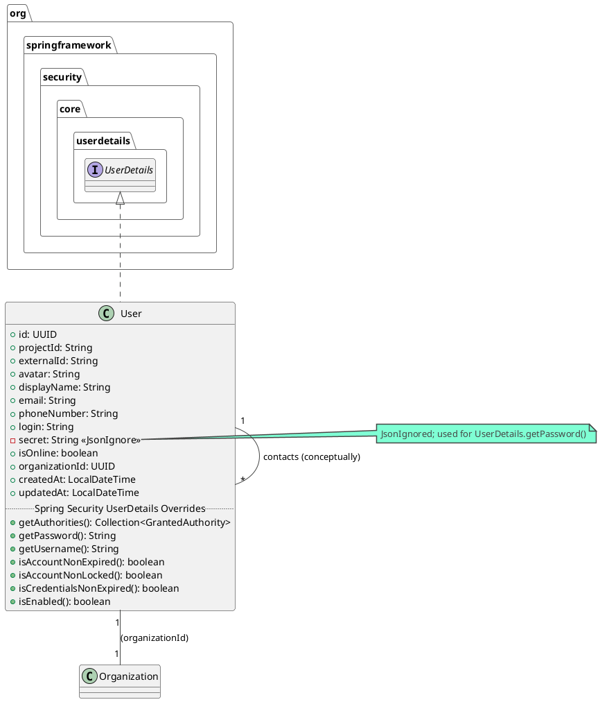

**Key Attributes:**

*   `id (UUID)`: The unique identifier for the user.
*   `projectId (String)`: Identifier for the project this user belongs to, used for multi-tenancy or scoping.
*   `externalId (String)`: An optional external identifier for mapping to other systems.
*   `avatar (String)`: URL or path to the user's avatar image.
*   `displayName (String)`: The name displayed for the user in the application.
*   `email (String)`: The user's email address.
*   `phoneNumber (String)`: The user's phone number.
*   `login (String)`: The username used for login.
*   `secret (String)`: The user's hashed password (not directly exposed via API).
*   `isOnline (boolean)`: Indicates if the user is currently online.
*   `customJson (Map<String, String>)`: A transient field for custom user properties (not directly mapped to a DB column, managed manually).
*   `contacts (List<User>)`: A transient field representing the user's contacts (other users). This relationship is managed manually.
*   `organizationId (UUID)`: The identifier of the [Organization](#organization) this user belongs to.
*   `createdAt (LocalDateTime)`: Timestamp of when the user account was created.
*   `updatedAt (LocalDateTime)`: Timestamp of the last update to the user account.

**Relationships:**

*   **UserDetails:** Implements methods from Spring Security's `UserDetails` interface for authentication and authorization. The `username` for Spring Security is a combination of `login` and `projectId`.
*   **Contacts (User):** A user can have a list of other users as contacts. This is a self-referential relationship. (Marked `@Transient` in the Java entity, implying manual management of this relation).
*   **Organization:** A user belongs to one [Organization](#organization) (identified by `organizationId`).

---

### Organization

The `Organization` entity represents a group or a company that uses Snappy Server. Each organization can have multiple users and chatbots associated with it. It also implements Spring Security's `UserDetails` interface, suggesting that an organization itself might be an authenticatable principal in some contexts (e.g., for administrative purposes or API access tied to the organization).

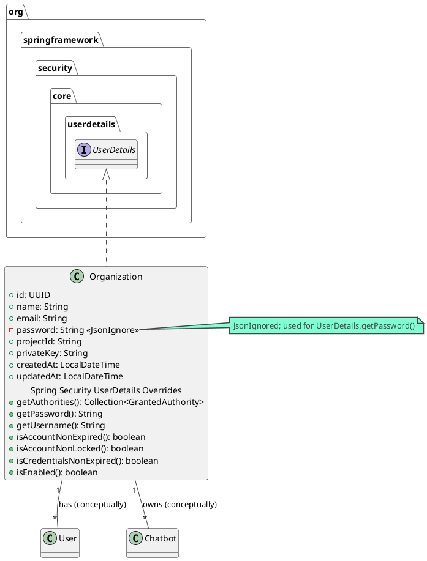

**Key Attributes:**

*   `id (UUID)`: The unique identifier for the organization.
*   `name (String)`: The name of the organization.
*   `email (String)`: The contact email for the organization. This is also used as the `username` for Spring Security's `UserDetails`.
*   `password (String)`: Hashed password for the organization (if it acts as an authenticatable principal).
*   `projectId (String)`: Identifier for the project this organization belongs to, potentially for data scoping.
*   `privateKey (String)`: A private key associated with the organization, possibly for encryption or signing purposes.
*   `users (List<User>)`: A transient field representing the list of [Users](#user) belonging to this organization. This relationship is typically established by `User` entities having an `organizationId`.
*   `chatbots (List<Chatbot>)`: A transient field representing the list of [Chatbots](#chatbot) owned by this organization.
*   `createdAt (LocalDateTime)`: Timestamp of when the organization was created.
*   `updatedAt (LocalDateTime)`: Timestamp of the last update to the organization's details.

**Relationships:**

*   **UserDetails:** Implements methods from Spring Security's `UserDetails` interface, allowing an organization to be treated as a security principal. The `email` field is used as the username.
*   **Users:** An organization can have multiple [Users](#user). This is conceptually a one-to-many relationship, where users store the `organizationId`.
*   **Chatbots:** An organization can own multiple [Chatbots](#chatbot). This is conceptually a one-to-many relationship (Chatbots would likely store an `organizationId`).

---

### Chat

The `Chat` entity represents a conversation session or channel between participants. These participants can be users or a user and a chatbot. It holds metadata about the chat, including the involved parties and the messaging mode.

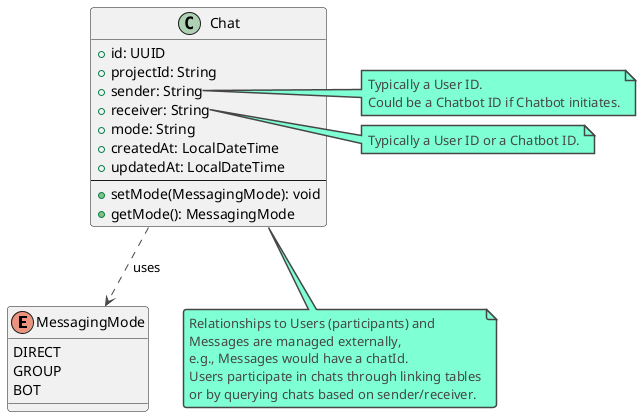

**Key Attributes:**

*   `id (UUID)`: The unique identifier for the chat session.
*   `projectId (String)`: Identifier for the project this chat belongs to, for scoping or multi-tenancy.
*   `sender (String)`: An identifier (e.g., User ID) for one of the participants in the chat. In a two-party chat, this could be the initiator or simply one of the parties.
*   `receiver (String)`: An identifier (e.g., User ID or Chatbot ID) for the other participant in the chat.
*   `mode (String)`: The messaging mode for this chat, stored as a string but corresponds to the `MessagingMode` enum (e.g., "DIRECT", "BOT").
*   `createdAt (LocalDateTime)`: Timestamp of when the chat session was created.
*   `updatedAt (LocalDateTime)`: Timestamp of the last activity or update in the chat session.

**Methods:**

*   `setMode(MessagingMode)`: Sets the chat mode using the `MessagingMode` enum.
*   `getMode(): MessagingMode`: Retrieves the chat mode as a `MessagingMode` enum.

**Relationships:**

*   **Participants (Conceptual):** While not directly storing collections of users, the `sender` and `receiver` fields link a chat to its participants (typically [Users](#user) or a [User](#user) and a [Chatbot](#chatbot)). In a group chat scenario (if supported by `MessagingMode`), the representation might differ or additional linking entities would be involved.
*   **Messages (Conceptual):** A chat is a container for [Messages](#message). Messages will typically store a `chatId` to associate themselves with a specific chat.
*   **MessagingMode (Enum):** The `mode` attribute uses the `MessagingMode` enum to define the type of chat.

---

### Message

The `Message` entity represents an individual piece of communication sent within a [Chat](#chat). It contains the content of the message, information about the sender and receiver, its acknowledgment status, and any associated attachments.

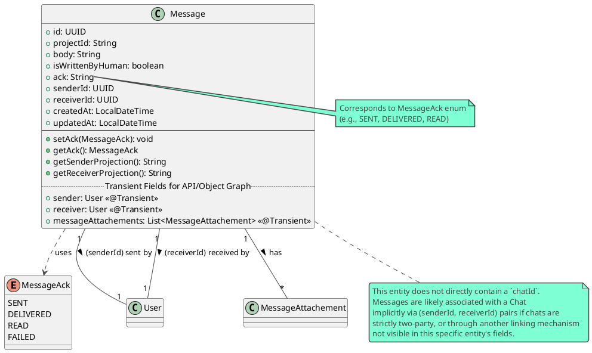

**Key Attributes:**

*   `id (UUID)`: The unique identifier for the message.
*   `projectId (String)`: Identifier for the project this message belongs to.
*   `body (String)`: The actual content of the message.
*   `isWrittenByHuman (boolean)`: Flag indicating if the message was sent by a human user (true) or a bot (false). Defaults to true.
*   `ack (String)`: The acknowledgment status of the message (e.g., "SENT", "DELIVERED", "READ"). Corresponds to the `MessageAck` enum.
*   `senderId (UUID)`: The ID of the [User](#user) who sent the message.
*   `receiverId (UUID)`: The ID of the [User](#user) or [Chatbot](#chatbot) who is the recipient of the message.
*   `createdAt (LocalDateTime)`: Timestamp of when the message was created/sent.
*   `updatedAt (LocalDateTime)`: Timestamp of the last update to the message (e.g., ack status change).

**Transient Attributes (for API/Object Graph):**

These fields are not directly persisted as columns in the `messages` table but are used for richer object representation in the application or API responses.
*   `sender (User)`: The actual [User](#user) object of the sender.
*   `receiver (User)`: The actual [User](#user) object of the receiver.
*   `messageAttachements (List<MessageAttachement>)`: A list of [MessageAttachements](#messageattachement) associated with this message.

**Methods:**

*   `setAck(MessageAck)`: Sets the acknowledgment status using the `MessageAck` enum.
*   `getAck(): MessageAck`: Retrieves the acknowledgment status as a `MessageAck` enum.
*   `getSenderProjection(): String`: Returns the `externalId` of the sender User, used for API projection.
*   `getReceiverProjection(): String`: Returns the `externalId` of the receiver User, used for API projection.

**Relationships:**

*   **Sender (User):** Each message is sent by one [User](#user), referenced by `senderId`.
*   **Receiver (User/Chatbot):** Each message is addressed to one [User](#user) or [Chatbot](#chatbot), referenced by `receiverId`.
*   **MessageAttachements:** A message can have multiple [MessageAttachements](#messageattachement) (e.g., files, images).
*   **Chat (Conceptual):** While `Message.java` does not have a `chatId` field, messages logically belong to a [Chat](#chat). This association might be inferred from `(senderId, receiverId)` pairs for direct chats or managed through other mechanisms in the system.
*   **MessageAck (Enum):** The `ack` attribute uses the `MessageAck` enum.

---

### Chatbot

The `Chatbot` entity represents an automated agent capable of participating in conversations. Chatbots are configured with specific behaviors (e.g., prompt, language model) and can be associated with organizations. They can interact with users through the chat system.

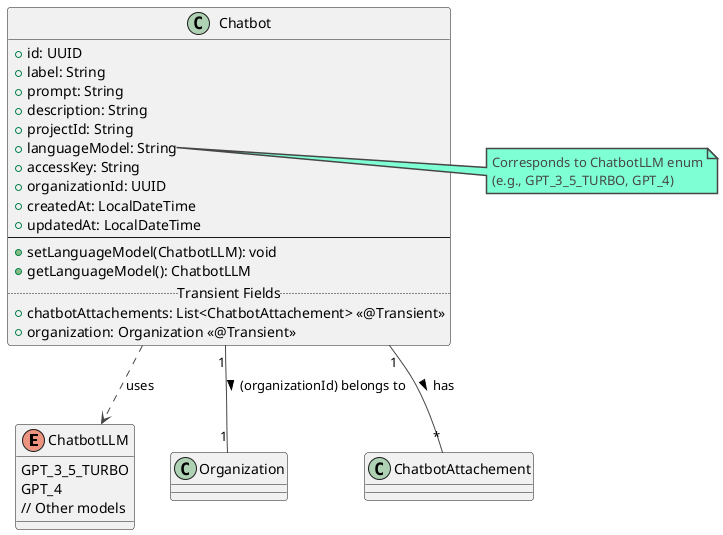

**Key Attributes:**

*   `id (UUID)`: The unique identifier for the chatbot.
*   `label (String)`: A user-friendly name or label for the chatbot.
*   `prompt (String)`: The system prompt or instructions defining the chatbot's behavior, personality, and context.
*   `description (String)`: A brief description of the chatbot's purpose or functionality.
*   `projectId (String)`: Identifier for the project this chatbot belongs to.
*   `languageModel (String)`: The underlying language model used by the chatbot (e.g., "GPT_3_5_TURBO"). Corresponds to the `ChatbotLLM` enum.
*   `accessKey (String)`: An access key, possibly for interacting with the language model provider or for securing chatbot access.
*   `organizationId (UUID)`: The ID of the [Organization](#organization) that owns or manages this chatbot.
*   `createdAt (LocalDateTime)`: Timestamp of when the chatbot was created.
*   `updatedAt (LocalDateTime)`: Timestamp of the last update to the chatbot's configuration.

**Transient Attributes:**

*   `chatbotAttachements (List<ChatbotAttachement>)`: A list of [ChatbotAttachements](#chatbotattachement) associated with this chatbot (e.g., knowledge base files).
*   `organization (Organization)`: The actual [Organization](#organization) object this chatbot belongs to.

**Methods:**

*   `setLanguageModel(ChatbotLLM)`: Sets the language model using the `ChatbotLLM` enum.
*   `getLanguageModel(): ChatbotLLM`: Retrieves the language model as a `ChatbotLLM` enum.

**Relationships:**

*   **Organization:** Each chatbot is associated with one [Organization](#organization), referenced by `organizationId`.
*   **ChatbotAttachements:** A chatbot can have multiple [ChatbotAttachements](#chatbotattachement), which might include documents for retrieval augmented generation (RAG) or other data.
*   **Chats (Conceptual):** Chatbots can participate in [Chats](#chat), typically as a message receiver (when a user talks to a bot) or sometimes as a sender (e.g., proactive messages, though not explicitly detailed here).
*   **ChatbotLLM (Enum):** The `languageModel` attribute uses the `ChatbotLLM` enum.

---

### MessageAttachement

The `MessageAttachement` entity represents a file or other media attached to a [Message](#message). It stores metadata about the attachment, such as its type, name, path, and size.

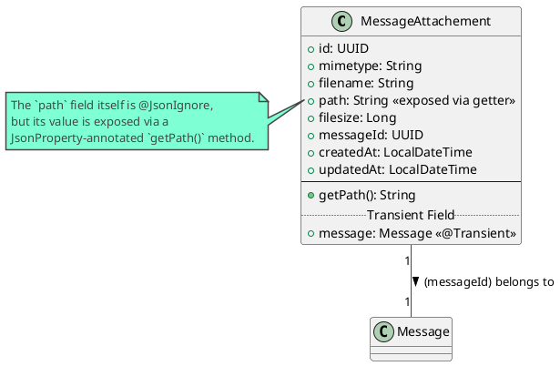

**Key Attributes:**

*   `id (UUID)`: The unique identifier for the message attachment.
*   `mimetype (String)`: The MIME type of the attachment (e.g., "image/jpeg", "application/pdf").
*   `filename (String)`: The original name of the attached file.
*   `path (String)`: The storage path of the attachment on the server or cloud storage. This field is marked `@JsonIgnore` but exposed via a `getPath()` method with `@JsonProperty("path")`.
*   `filesize (Long)`: The size of the attachment in bytes.
*   `messageId (UUID)`: The ID of the [Message](#message) this attachment belongs to.
*   `createdAt (LocalDateTime)`: Timestamp of when the attachment was created/uploaded.
*   `updatedAt (LocalDateTime)`: Timestamp of the last update to the attachment's metadata.

**Transient Attributes:**

*   `message (Message)`: The actual [Message](#message) object this attachment is associated with.

**Methods:**

*   `getPath(): String`: Exposes the `path` of the attachment, useful for API serialization.

**Relationships:**

*   **Message:** Each attachment belongs to one [Message](#message), referenced by `messageId`.

---

### ChatbotAttachement

The `ChatbotAttachement` entity represents a file or resource associated with a [Chatbot](#chatbot). These attachments are often used as part of a knowledge base for Retrieval Augmented Generation (RAG) or to provide other data necessary for the chatbot's functionality.

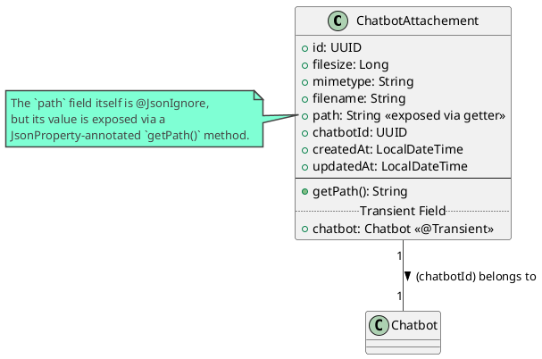

**Key Attributes:**

*   `id (UUID)`: The unique identifier for the chatbot attachment.
*   `filesize (Long)`: The size of the attached file in bytes.
*   `mimetype (String)`: The MIME type of the attachment (e.g., "text/plain", "application/pdf").
*   `filename (String)`: The original name of the attached file.
*   `path (String)`: The storage path of the attachment. Similar to `MessageAttachement`, this field is `@JsonIgnore` but exposed via a `getPath()` method with `@JsonProperty("path")`.
*   `chatbotId (UUID)`: The ID of the [Chatbot](#chatbot) this attachment is associated with.
*   `createdAt (LocalDateTime)`: Timestamp of when the attachment was created/uploaded.
*   `updatedAt (LocalDateTime)`: Timestamp of the last update to the attachment's metadata.

**Transient Attributes:**

*   `chatbot (Chatbot)`: The actual [Chatbot](#chatbot) object this attachment is associated with.

**Methods:**

*   `getPath(): String`: Exposes the `path` of the attachment, useful for API serialization.

**Relationships:**

*   **Chatbot:** Each attachment belongs to one [Chatbot](#chatbot), referenced by `chatbotId`. This is crucial for linking knowledge sources or other resources directly to a specific bot.

---

## Key Domain Use Cases

This section describes some of the core use cases within the Domain Layer, illustrating the flow of operations and interactions between domain entities and services.

---

### 1. Send Message

**Purpose:** This use case handles the process of a user sending a message to another user or a chatbot. It involves validating the participants, saving the message and any attachments, and then attempting to deliver the message in real-time via WebSockets. If the recipient is offline, the message is stored for later delivery.

**Input DTO (`SendMessageDto`):**
*   `senderId: String` (External ID of the sender)
*   `receiverId: String` (External ID of the receiver)
*   `projectId: String`
*   `body: String` (Content of the message)
*   `attachements: List<File>` (Optional list of attached files)

**Pre-conditions:**
*   Sender and Receiver must be valid users (or a valid user and a chatbot) identified by their external IDs and project ID.
*   The `projectId` must be valid.

**Post-conditions:**
*   A `Message` entity is created and persisted in the database.
*   If attachments are provided, corresponding `MessageAttachement` entities are created and persisted, linked to the message.
*   The message is delivered to the recipient via WebSocket if they are online.
*   The message is also sent back to the sender via WebSocket (for synchronization).
*   If the recipient is offline, the message is stored in `NotSentMessagesStorage`.
*   (Potentially) The message is forwarded to an external service ("Alan") based on chat settings.

**Diagram (Sequence):**

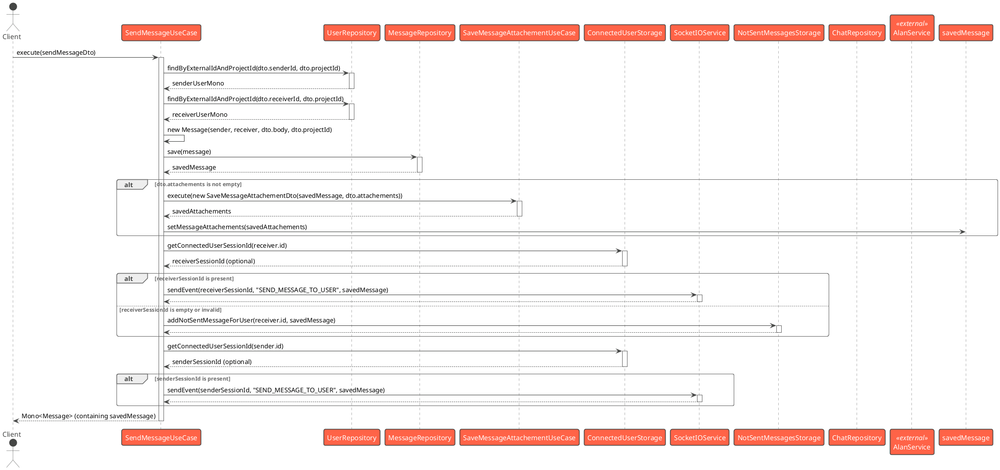

**Steps:**

1.  The use case receives a `SendMessageDto` containing sender ID, receiver ID, project ID, message body, and optional attachments.
2.  It validates that sender, receiver, and project IDs are provided.
3.  It retrieves the sender `User` entity from the `UserRepository` using the external ID and project ID. If not found, it returns an error.
4.  It retrieves the receiver `User` entity similarly. If not found, it returns an error.
5.  A new `Message` object is instantiated with the sender, receiver, body, and project ID.
6.  The `Message` is saved to the `MessageRepository`.
7.  If the `SendMessageDto` contains attachments:
    a.  The `SaveMessageAttachementUseCase` is called to process and save each attachment.
    b.  The saved `MessageAttachement` details are associated with the `Message` object.
8.  The use case attempts to send the message to the recipient:
    a.  It queries `ConnectedUserStorage` for the recipient's active WebSocket session ID.
    b.  If a session exists, the `SocketIOService` (representing `SocketIOServer`) is used to send a "SEND_MESSAGE_TO_USER" event with the message data to the recipient's client.
    c.  If no session exists (user is offline or session is invalid), the message is added to the `NotSentMessagesStorage` for later delivery when the user reconnects.
9.  The use case also attempts to send the message back to the sender (e.g., to confirm it was sent and for multi-device sync):
    a.  It queries `ConnectedUserStorage` for the sender's active WebSocket session ID.
    b.  If a session exists, the `SocketIOService` sends the message to the sender's client.
10. (Optional, based on commented-out code) The use case might retrieve the `Chat` settings from `ChatRepository`. If the chat's `MessagingMode` indicates integration with an external service ("Alan"), an HTTP POST request with the message is made to that `AlanService`.
11. The use case returns a `Mono<Message>` wrapping the saved message.

---

### 2. Authenticate User

**Purpose:** This use case handles user authentication. It verifies a user's credentials (login, password, project ID) against stored data and, if valid, generates a JSON Web Token (JWT) for session management.

**Input DTO (`AuthenticateUserDto`):**
*   `login: String` (User's login identifier)
*   `projectId: String`
*   `secret: String` (User's password)

**Output (`AuthenticationResource<User>`):**
*   `data: User` (The authenticated User entity)
*   `token: String` (The generated JWT)

**Pre-conditions:**
*   The user must already exist in the system with the given `login` and `projectId`.

**Post-conditions:**
*   If authentication is successful, a JWT is generated and returned along with the authenticated user's details.
*   If authentication fails (user not found or password mismatch), an `AuthenticationFailedException` is thrown.

**Diagram (Sequence):**

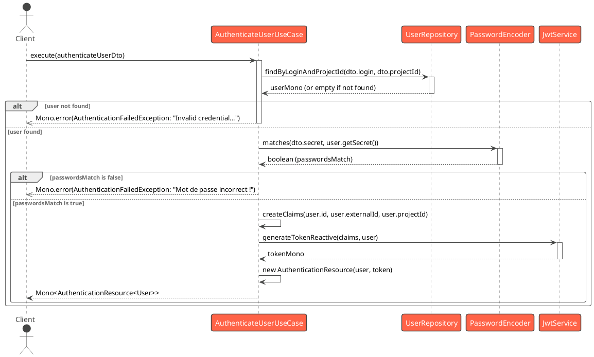

**Steps:**

1.  The use case receives an `AuthenticateUserDto` containing the user's login, project ID, and secret (password).
2.  It queries the `UserRepository` to find a user matching the provided `login` and `projectId`.
3.  If no user is found, the use case immediately returns a `Mono.error` with an `AuthenticationFailedException`.
4.  If a user is found, the `PasswordEncoder` is used to compare the `secret` from the DTO with the hashed `secret` stored in the `User` entity.
5.  If the passwords do not match, the use case returns a `Mono.error` with an `AuthenticationFailedException`.
6.  If the passwords match, a set of claims (including `userId`, `externalId`, `projectId`) is prepared for the JWT.
7.  The `JwtService` is called with these claims and the `User` object to generate a new JWT.
8.  The authenticated `User` entity and the generated `token` are wrapped in an `AuthenticationResource`.
9.  The use case returns a `Mono<AuthenticationResource<User>>` containing the user data and the token.

---

### 3. Create User

**Purpose:** This use case handles the creation of a new user in the system. It involves validating the input data, checking for existing users with the same external ID, associating the user with an organization (based on project ID), hashing the password, and persisting the new user entity.

**Input DTO (`CreateUserDto`):**
*   `externalId: String` (Mandatory)
*   `displayName: String` (Mandatory)
*   `login: String` (Mandatory)
*   `secret: String` (Mandatory, user's password)
*   `projectId: String` (Mandatory, identifies the organization)
*   `avatar: String` (Optional)
*   `email: String` (Optional, validated format)
*   `phoneNumber: String` (Optional, validated format)
*   `customJson: Map<String, String>` (Optional)

**Output (`User`):**
*   The newly created `User` entity.

**Pre-conditions:**
*   An `Organization` must exist for the given `projectId`.
*   A user with the same `externalId` and `projectId` must not already exist.
*   Input data must meet validation criteria (required fields, email/phone format).

**Post-conditions:**
*   A new `User` entity is created and persisted in the database with a hashed password.
*   The user is associated with the correct organization.
*   If validation fails or user already exists/project not found, an appropriate exception is thrown.
*   The operation is performed transactionally.

**Diagram (Sequence):**

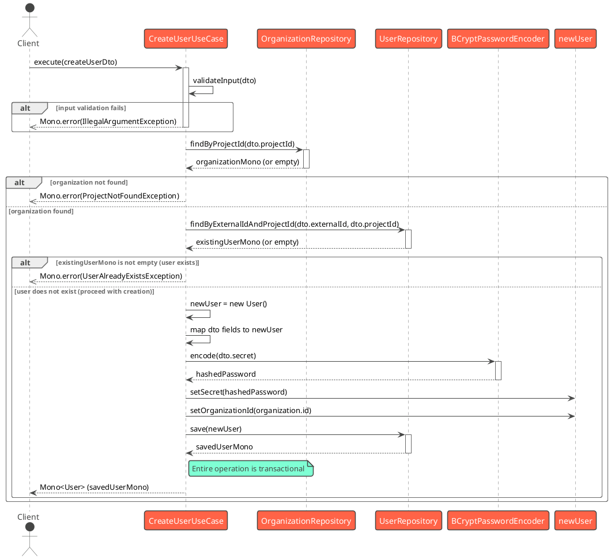

**Steps:**

1.  The use case receives a `CreateUserDto` with the new user's details.
2.  It first performs input validation (e.g., required fields like `externalId`, `displayName`, `login`, `secret`, `projectId`, and format validation for `email` and `phoneNumber`). If validation fails, an `IllegalArgumentException` is returned.
3.  It queries the `OrganizationRepository` to find an `Organization` matching the `dto.getProjectId()`.
    *   If no organization is found for the project ID, a `ProjectNotFoundException` is returned.
4.  If an organization is found, it then queries the `UserRepository` to check if a `User` with the same `dto.getExternalId()` and `dto.getProjectId()` already exists.
    *   If such a user already exists, a `UserAlreadyExistsException` is returned.
5.  If the organization exists and the user does not already exist:
    a.  A new `User` entity is instantiated.
    b.  Properties from the `CreateUserDto` (avatar, displayName, email, phone, externalId, login, customJson, projectId) are mapped to the new `User` entity.
    c.  The `secret` (password) from the DTO is encoded using `BCryptPasswordEncoder`.
    d.  The `organizationId` from the fetched organization is set on the new user.
    e.  The new `User` entity is saved to the `UserRepository`.
6.  The entire sequence of fetching the organization, checking for user existence, and saving the new user is performed within a database transaction (managed by `TransactionalOperator`).
7.  The use case returns a `Mono<User>` containing the newly created and persisted user.

---

### 4. Get User Chats

**Purpose:** This use case retrieves a list of chat sessions for a given user. Each chat session is represented by the other participant (interlocutor) and the last message exchanged in that conversation. It effectively reconstructs the chat list based on message history.

**Input DTO (`GetUserChatsDto`):**
*   `externalUserId: String` (External ID of the user whose chats are to be fetched)
*   `projectId: String`

**Output (`Flux<ChatResource>`):**
*   A stream of `ChatResource` objects, where each resource contains:
    *   `user: User` (The other participant/interlocutor in the chat)
    *   `lastMessage: Message` (The most recent message in the chat with that interlocutor)

**Pre-conditions:**
*   The user identified by `externalUserId` and `projectId` must exist.

**Post-conditions:**
*   A `Flux` emitting `ChatResource` objects is returned. Each resource summarizes a conversation with another user, ordered implicitly by the activity (last message time is available).
*   If the user is not found, an error is emitted.

**Diagram (Sequence):**

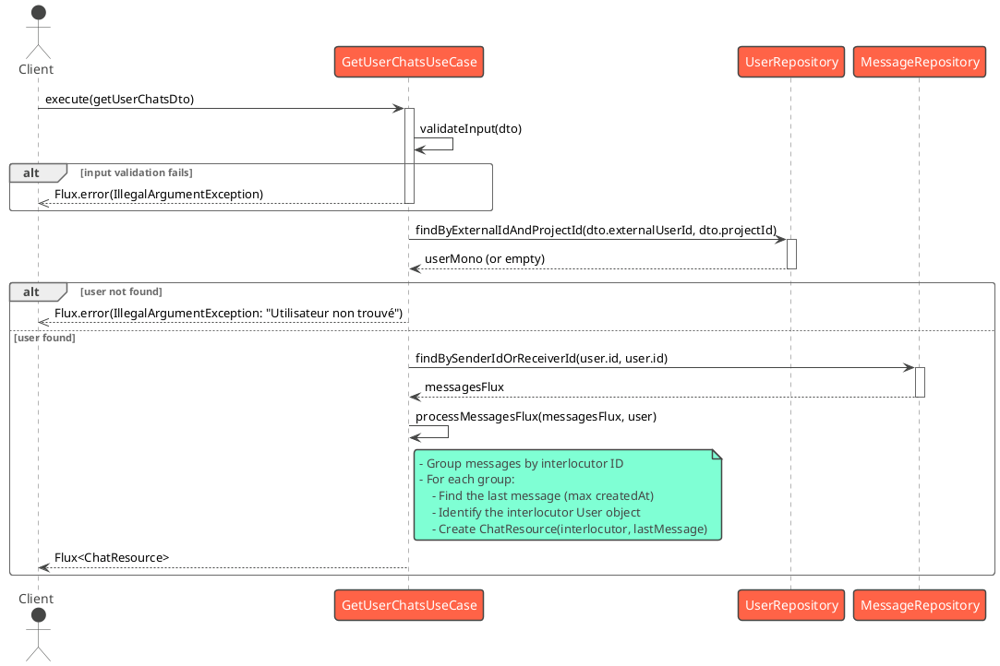

**Steps:**

1.  The use case receives a `GetUserChatsDto` containing the `externalUserId` and `projectId`.
2.  Input validation is performed. If `externalUserId` or `projectId` is missing, a `Flux.error` with `IllegalArgumentException` is returned.
3.  The `UserRepository` is queried to find the `User` corresponding to the `externalUserId` and `projectId`.
    *   If the user is not found, a `Flux.error` with `IllegalArgumentException ("Utilisateur non trouvé")` is returned.
4.  If the user is found:
    a.  The `MessageRepository` is queried to fetch all `Message` entities where the user's ID is either the `senderId` or `receiverId`. This returns a `Flux<Message>`.
    b.  This `Flux<Message>` is processed:
        i.  Messages are grouped based on the ID of the "interlocutor" (the other party in the conversation). The interlocutor is identified by checking if the message's sender is the requesting user; if so, the receiver is the interlocutor, otherwise, the sender is.
        ii. For each group of messages (representing a conversation with one interlocutor):
            1.  The messages within the group are collected.
            2.  The most recent message (last message) is determined by finding the one with the maximum `createdAt` timestamp.
            3.  The `User` object of the interlocutor is identified from this last message.
            4.  A `ChatResource` object is created, containing the interlocutor `User` and the `lastMessage`.
    c.  The use case returns a `Flux<ChatResource>`, emitting these resources one by one.

---

### 5. Create Chatbot

**Purpose:** This use case handles the creation of a new chatbot. It involves associating the chatbot with an organization (via project ID), saving its configuration (label, prompt, language model), processing any initial attachments (e.g., for a knowledge base), and potentially notifying external services.

**Input DTO (`CreateChatbotDto`):**
*   `projectId: String` (Identifies the organization)
*   `label: String`
*   `prompt: String`
*   `description: String` (Optional)
*   `languageModel: ChatbotLLM` (Enum, e.g., GPT_3_5_TURBO)
*   `attachements: List<File>` (Optional list of files for chatbot's knowledge base)

**Output (`Chatbot`):**
*   The newly created `Chatbot` entity, potentially with its relations loaded (e.g., Organization object).

**Pre-conditions:**
*   An `Organization` must exist for the given `projectId`.
*   Input data for the chatbot (label, prompt, language model) must be valid.

**Post-conditions:**
*   A new `Chatbot` entity is created and persisted.
*   An `accessKey` is automatically generated for the chatbot.
*   If attachments are provided, corresponding `ChatbotAttachement` entities are created and linked.
*   The chatbot entity, potentially enriched with its relationships, is returned.
*   (Future) Details might be sent to an external "Alan" service.

**Diagram (Sequence):**

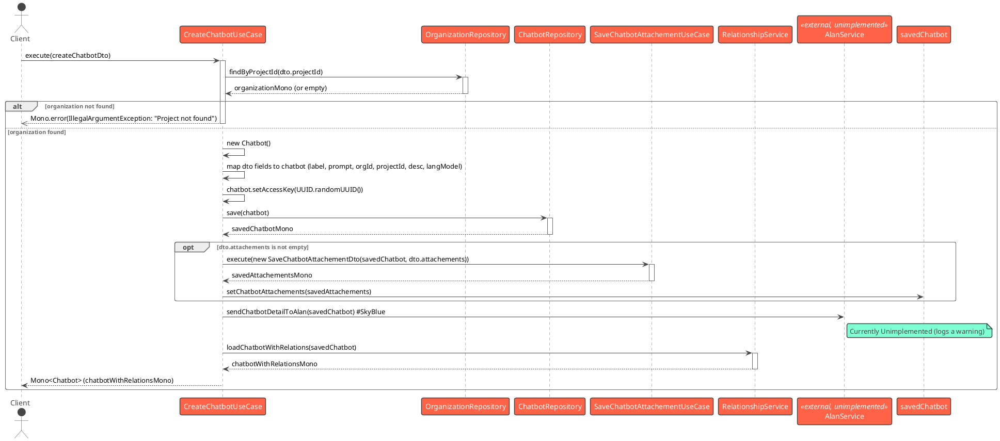

**Steps:**

1.  The use case receives a `CreateChatbotDto` containing the project ID, label, prompt, description, language model, and optional attachments.
2.  It queries the `OrganizationRepository` to find an `Organization` matching `dto.getProjectId()`.
    *   If no organization is found, a `Mono.error` with an `IllegalArgumentException ("Project not found")` is returned.
3.  If the organization is found:
    a.  A new `Chatbot` entity is instantiated.
    b.  Properties from the DTO (`label`, `prompt`, `description`, `languageModel`) are set.
    c.  The `organizationId` from the fetched organization and the `projectId` from the DTO are set.
    d.  A unique `accessKey` is generated (using `UUID.randomUUID().toString()`) and set for the chatbot.
    e.  The new `Chatbot` entity is saved to the `ChatbotRepository`.
4.  If the `CreateChatbotDto` contains attachments:
    a.  The `SaveChatbotAttachementUseCase` is called with the saved chatbot and the list of attachments. This use case will handle saving each `ChatbotAttachement` and linking it to the chatbot.
    b.  The saved `ChatbotAttachement` details are (transiently) associated with the `Chatbot` object in memory.
5.  The use case calls `sendChatbotDetailToAlan(chatbot)`. **Note:** As per the source code, this method is currently a placeholder and logs a warning that it's unimplemented. In the future, it would likely make an HTTP request to an external "Alan" service.
6.  Finally, `relationshipService.loadChatbotWithRelations(chatbot)` is called. This service likely fetches and populates related entities (like the `Organization` object itself) onto the `Chatbot` entity before it's returned.
7.  The use case returns a `Mono<Chatbot>` containing the newly created chatbot, potentially enriched with its relational data.

---
