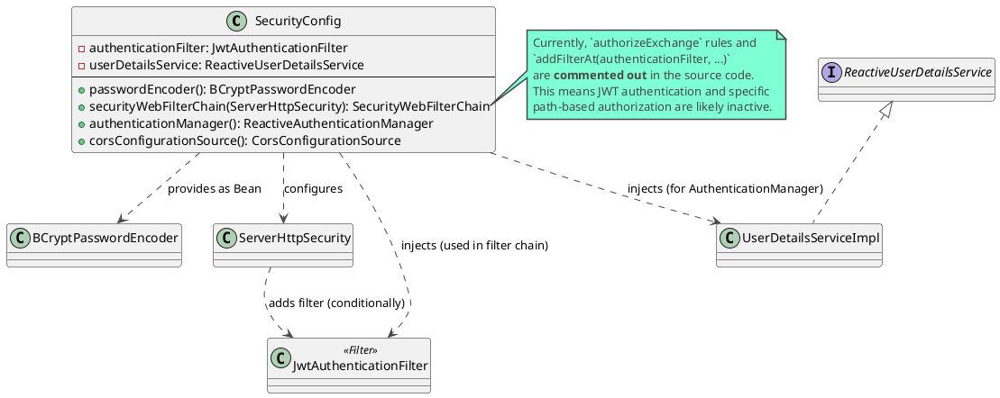
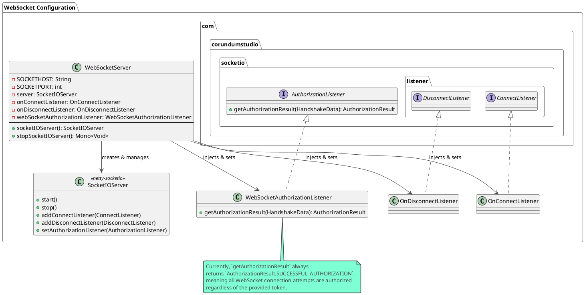
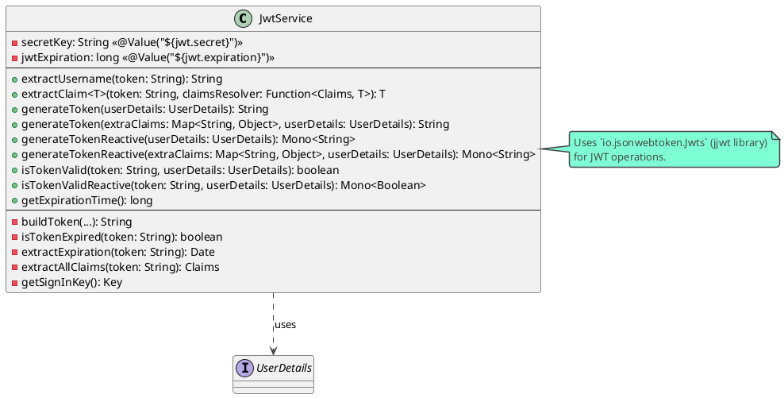
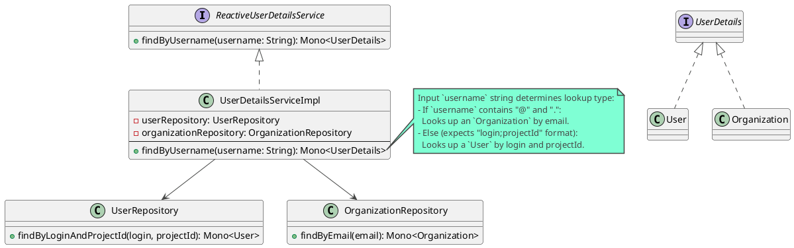
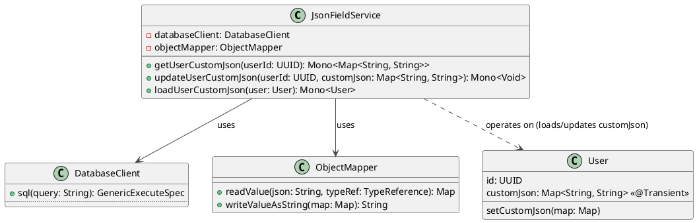

# Infrastructure Layer Documentation

This document provides an overview of the Infrastructure Layer of the Snappy Server application. This layer is responsible for all technical concerns, including framework configurations, data access, and interactions with external services.

## Key Configuration Classes

The Infrastructure Layer uses various Spring Boot configuration classes to set up and manage technical aspects of the application.

---

### SecurityConfig

**Purpose:** `SecurityConfig` is central to the application's security setup. It uses Spring Security with `@EnableWebFluxSecurity` to define how HTTP requests are secured, including authentication, authorization, CORS, and CSRF policies. It also defines the password encoding mechanism.



**Key Responsibilities & Configurations:**

*   **Enabling WebFlux Security:** The `@EnableWebFluxSecurity` annotation enables Spring Security features for reactive web applications.
*   **Password Encoding:**
    *   It defines a `BCryptPasswordEncoder` bean, which is the standard mechanism for hashing and verifying passwords.
*   **Security Filter Chain (`securityWebFilterChain`):** This bean configures the core security rules:
    *   **CSRF Protection:** CSRF (Cross-Site Request Forgery) protection is disabled (`csrfSpec::disable`). This is common for stateless APIs (like those using JWTs) where browser session-based CSRF is less of a concern.
    *   **CORS Configuration:** It applies CORS (Cross-Origin Resource Sharing) rules using a `corsConfigurationSource` bean, allowing requests from configured origins (e.g., `http://localhost:5173`, `https://snappy-teal.vercel.app`) and specifying allowed methods and headers.
    *   **Request Authorization (`authorizeExchange` - Currently Commented Out):**
        *   This section (if active) would define which paths are public (e.g., `/auth/**`, `/api-docs/**`) and which require authentication.
        *   For example, it might permit all `POST` requests to `/organizations` and `GET` requests to `/organizations` while requiring authentication for any other exchange (`anyExchange().authenticated()`).
    *   **JWT Authentication Filter (`addFilterAt` - Currently Commented Out):**
        *   If active, this would add the `JwtAuthenticationFilter` to the security filter chain at the `SecurityWebFiltersOrder.AUTHENTICATION` position. This filter is responsible for intercepting requests, extracting JWTs, validating them, and setting up the security context if the token is valid.
    *   **Current Status:** As of the last review, the `authorizeExchange` rules and the addition of `JwtAuthenticationFilter` are commented out in the source code. This implies that either security is handled differently (e.g., at an API gateway level) or the application is currently not enforcing these specific JWT-based authentication and path authorization rules.
*   **Authentication Manager (`authenticationManager`):**
    *   It configures a `ReactiveAuthenticationManager`. Specifically, it uses `UserDetailsRepositoryReactiveAuthenticationManager`, which integrates with a `ReactiveUserDetailsService` (this would be `UserDetailsServiceImpl` in this application) to fetch user details and the `BCryptPasswordEncoder` to verify passwords during the authentication process (e.g., for username/password logins, though JWT flow is primary focus if filter is active).

**Dependencies:**

*   `JwtAuthenticationFilter`: Injected to be added to the filter chain (though currently commented out).
*   `ReactiveUserDetailsService` (typically `UserDetailsServiceImpl`): Injected to be used by the `ReactiveAuthenticationManager`.

**Notes:**

*   The current commented-out state of crucial security rules (`authorizeExchange` and `JwtAuthenticationFilter` registration) is a significant aspect of this configuration. Documentation should reflect this actual state, while also explaining the intended functionality if those sections were active.

---

### JwtAuthenticationFilter

**Purpose:** `JwtAuthenticationFilter` is a Spring `WebFilter` responsible for JWT-based authentication. It intercepts incoming HTTP requests, inspects them for a JWT in the "Authorization" header, validates the token, and if valid, populates the Spring Security context with authentication information.

```plantuml
@startuml
!theme vibrant

interface WebFilter {
  + filter(ServerWebExchange, WebFilterChain): Mono<Void>
}

class JwtAuthenticationFilter implements WebFilter {
  - jwtService: JwtService
  - userDetailsService: ReactiveUserDetailsService
  --
  + filter(ServerWebExchange, WebFilterChain): Mono<Void>
}

class JwtService {
  + extractUsername(token): String
  + isTokenValid(token, UserDetails): boolean
}
class UserDetailsServiceImpl implements ReactiveUserDetailsService {
  + findByUsername(username): Mono<UserDetails>
}
class ReactiveSecurityContextHolder <<static>> {
  + withAuthentication(Authentication): Context
}

note left of JwtAuthenticationFilter
  This filter would be added to the
  Spring Security filter chain by `SecurityConfig`.
  (Currently, this addition is commented out).
end note

JwtAuthenticationFilter --> JwtService : uses
JwtAuthenticationFilter --> UserDetailsServiceImpl : uses
JwtAuthenticationFilter ..> ReactiveSecurityContextHolder : updates context

box "HTTP Request Processing" #LightBlue
  participant "Client Request" as Request
  participant JwtAuthenticationFilter as Filter
  participant "Rest of Filter Chain & Controller" as Next
end box

Request -> Filter : HTTP Request with/without JWT
activate Filter
Filter -> Request : getHeader("Authorization")
alt "Authorization: Bearer <jwt>" present
  Filter -> JwtService : extractUsername(jwt)
  JwtService --> Filter : username
  alt username extracted
    Filter -> UserDetailsServiceImpl : findByUsername(username)
    UserDetailsServiceImpl --> Filter : userDetailsMono
    alt userDetails found AND jwtService.isTokenValid(jwt, userDetails)
      Filter -> ReactiveSecurityContextHolder : withAuthentication(auth)
      Filter -> Next : chain.filter(exchange)
    else token invalid or user not found
      Filter -> Next : chain.filter(exchange) (unauthenticated)
    end
  else username not extracted
    Filter -> Next : chain.filter(exchange) (unauthenticated)
  end
else No/Invalid Authorization Header
  Filter -> Next : chain.filter(exchange) (unauthenticated)
end
deactivate Filter
Next --> Request : HTTP Response
@enduml
```

**Key Responsibilities & Workflow:**

1.  **Interception:** As a `WebFilter`, it intercepts every incoming `ServerWebExchange`.
2.  **Token Extraction:**
    *   It checks the `Authorization` header for a token prefixed with "Bearer ".
    *   If the header is missing or not in the correct format, the filter passes the request to the next filter in the chain without attempting authentication.
3.  **Username Extraction:**
    *   If a Bearer token is found, the JWT string is extracted.
    *   The `JwtService` is used to parse the token and extract the username (`subject` of the JWT).
4.  **User Details Loading:**
    *   If a username is successfully extracted from the token, the `ReactiveUserDetailsService` (i.e., `UserDetailsServiceImpl`) is called to load the `UserDetails` for that username.
5.  **Token Validation:**
    *   The loaded `UserDetails` and the JWT are then passed to `jwtService.isTokenValid()` to verify the token's signature and check if it has expired.
6.  **Security Context Population:**
    *   If the token is valid and user details are found:
        *   A `UsernamePasswordAuthenticationToken` is created with the user details, null credentials (as JWT is used), and user authorities.
        *   This authentication token is set into the `ReactiveSecurityContextHolder`, making it available throughout the request processing lifecycle for authorization checks.
    *   The request then proceeds to the next filter in the chain, now with an authenticated security context.
7.  **Chain Continuation:** If at any point the token is deemed invalid, missing, or the user details cannot be found, the filter proceeds down the chain without setting an authentication in the security context. Subsequent security checks (if any) would treat the request as anonymous or unauthenticated.

**Dependencies:**

*   `JwtService`: Used to extract claims from the JWT (like username) and to validate the token's integrity and expiration.
*   `ReactiveUserDetailsService` (typically `UserDetailsServiceImpl`): Used to fetch user details from the database based on the username extracted from the JWT.

**Integration with `SecurityConfig`:**

*   This filter is designed to be registered within the Spring Security filter chain by `SecurityConfig`. However, as noted in `SecurityConfig`'s documentation, its registration (`addFilterAt(authenticationFilter, ...)`) is currently commented out. If active, it would play a crucial role in securing application endpoints by enforcing JWT authentication.

---

### WebSocketServer and WebSocketAuthorizationListener

**Purpose:** These classes are responsible for setting up and managing the WebSocket server using the `netty-socketio` library. `WebSocketServer` configures and starts the `SocketIOServer`, while `WebSocketAuthorizationListener` (ideally) handles authorization for incoming WebSocket connections.



**`WebSocketServer.java` Key Responsibilities:**

*   **Server Initialization (`socketIOServer` bean):**
    *   Creates a `com.corundumstudio.socketio.Configuration` object.
    *   Sets the hostname and port for the WebSocket server from application properties (`socket.host`, `socket.port`).
    *   Sets various server options like `allowCustomRequests`, `upgradeTimeout`, and `pingTimeout`.
    *   **Crucially, it assigns an instance of `WebSocketAuthorizationListener` to the server configuration.** This listener is invoked for every new client attempting to connect.
    *   Instantiates the `SocketIOServer` with this configuration.
    *   Starts the server.
    *   Registers `OnConnectListener` and `OnDisconnectListener` to handle client connection and disconnection events respectively. These listeners are expected to be defined elsewhere (e.g., in the `presentation.listeners` package).
*   **Lifecycle Management:**
    *   The `socketIOServer()` method is a Spring `@Bean` method, so Spring manages its lifecycle.
    *   A `@PreDestroy` annotated method `stopSocketIOServer()` ensures that the `SocketIOServer` is stopped gracefully when the application context is closed.

**`WebSocketAuthorizationListener.java` Key Responsibilities:**

*   **Authorization Logic (`getAuthorizationResult` method):**
    *   This method is called by the `SocketIOServer` when a new client tries to establish a WebSocket connection, before the connection is fully established.
    *   It receives `HandshakeData` which can include headers and authentication tokens (e.g., passed as a query parameter or a custom header during the WebSocket handshake).
    *   The current implementation logs the `handshakeData.getAuthToken()` and headers.
    *   **Important:** It **always returns `AuthorizationResult.SUCCESSFUL_AUTHORIZATION`**. This means that, in its current state, the WebSocket server effectively allows any connection attempt to succeed from an authorization perspective, irrespective of any token that might be present or its validity. For a secure setup, this listener would typically validate the token (e.g., a JWT) and return `AuthorizationResult.FAILED_AUTHORIZATION` if validation fails.

**Overall WebSocket Setup:**

*   The `WebSocketServer` sets up the technical infrastructure for real-time bi-directional communication.
*   Event-specific logic (what happens when a client connects, disconnects, or sends specific messages) is delegated to various listeners (like `OnConnectListener`, `OnDisconnectListener`, and other custom event listeners not shown in this configuration class but would be added to the `SocketIOServer` instance elsewhere).
*   The `WebSocketAuthorizationListener` is the entry point for securing WebSocket connections, though its current implementation is permissive.

---

### R2dbcConfig

**Purpose:** `R2dbcConfig` configures the R2DBC (Reactive Relational Database Connectivity) settings for the application. This includes enabling R2DBC repositories, setting up auditing, providing a `DatabaseClient`, and defining custom behavior like automatic UUID generation for entities.

```plantuml
@startuml
!theme vibrant

abstract class AbstractR2dbcConfiguration
class R2dbcConfig extends AbstractR2dbcConfiguration {
  - connectionFactory: ConnectionFactory
  --
  + connectionFactory(): ConnectionFactory
  + databaseClient(): DatabaseClient
  # getCustomConverters(): List<Object>
  + auditorProvider(): ReactiveAuditorAware<String>
  + beforeConvertCallback(): BeforeConvertCallback<Object>
}

interface ConnectionFactory
interface DatabaseClient
interface ReactiveAuditorAware<String>
interface BeforeConvertCallback<Object>
class Entity {
  @Id
  id: UUID
  value: String
}

R2dbcConfig ..> ConnectionFactory : uses
R2dbcConfig ..> DatabaseClient : provides
R2dbcConfig ..> "ReactiveAuditorAware<String>" : provides (returns "SYSTEM")
R2dbcConfig ..> "BeforeConvertCallback<Object>" : provides (auto UUID generation)

note right of R2dbcConfig::beforeConvertCallback
  Inspects entities before saving.
  If an entity has `@Id UUID id` field
  and `id` is null, it generates a new UUID.
end note

box "Spring Data R2DBC" #LightGreen
  participant "R2DBC Lifecycle" as Lifecycle
  participant "BeforeConvertCallback" as Callback
  participant "Entity" as EntityInstance
end box

Lifecycle -> Callback : trigger(entity)
Callback -> EntityInstance : getId()
alt id == null AND field is @Id UUID
  Callback -> EntityInstance : setId(UUID.randomUUID())
end
Callback --> Lifecycle : modifiedEntity
Lifecycle -> "Database" : save(modifiedEntity)


@enduml
```

**Key Responsibilities & Configurations:**

*   **Extends `AbstractR2dbcConfiguration`:** Leverages Spring Data R2DBC's base configuration class.
*   **Enabling R2DBC Repositories (`@EnableR2dbcRepositories`):**
    *   Scans the package `org.enspy.snappy.server.infrastructure.repositories` for interfaces extending Spring Data's `ReactiveCrudRepository` (or similar) and creates proxy instances for them.
*   **Enabling R2DBC Auditing (`@EnableR2dbcAuditing`):**
    *   Activates auditing features, allowing automatic population of fields like `@CreatedDate`, `@LastModifiedDate`, `@CreatedBy`, and `@LastModifiedBy` in domain entities.
*   **Connection Factory (`connectionFactory()`):**
    *   Provides the R2DBC `ConnectionFactory`. This is typically auto-configured by Spring Boot based on application properties (e.g., `spring.r2dbc.url`, username, password). `R2dbcConfig` simply makes this auto-configured factory available to other R2DBC components it defines.
*   **Database Client (`databaseClient()`):**
    *   Defines a `DatabaseClient` bean. The `DatabaseClient` is a non-blocking, reactive client for interacting with the database, allowing for more direct query execution compared to repositories.
*   **Custom Converters (`getCustomConverters()`):**
    *   Provides a hook to register custom converters for mapping between database types and Java types. Currently, no custom converters are added.
*   **Auditor Provider (`auditorProvider()`):**
    *   Defines a `ReactiveAuditorAware<String>` bean. This bean is used by the auditing feature to determine the current auditor (user) when setting `@CreatedBy` or `@LastModifiedBy` fields.
    *   The current implementation always returns `Mono.just("SYSTEM")`, meaning auditable entities will have "SYSTEM" as their creator/modifier if these fields are of type String.
*   **Automatic UUID Generation (`beforeConvertCallback()`):**
    *   This is a significant custom behavior. It registers a `BeforeConvertCallback<Object>`.
    *   This callback is invoked by Spring Data R2DBC before an entity is converted and sent to the database for saving.
    *   **Logic:** It uses reflection to check if the entity has a field annotated with `@org.springframework.data.annotation.Id`, if this field is of type `UUID`, and if its current value is `null`.
    *   If all these conditions are met, it generates a new `UUID.randomUUID()` and sets it on the ID field of the entity.
    *   **Effect:** This provides automatic primary key generation for entities using UUIDs, ensuring that entities saved without a pre-assigned ID get one.

**Overall Impact:**

`R2dbcConfig` plays a crucial role in bridging the application with the reactive database driver. It not only enables standard Spring Data R2DBC features but also introduces important custom logic like default auditing to "SYSTEM" and, most notably, the automatic generation of UUIDs for new entities, simplifying entity creation.

---

### OpenApiConfig

**Purpose:** `OpenApiConfig` configures the OpenAPI (formerly Swagger) documentation for the application. It's used by tools like Springdoc-openapi to generate an interactive API documentation UI, typically available at `/swagger-ui.html`. This class defines general API information and how security (specifically JWT Bearer authentication) is represented in the API documentation.

**Key Responsibilities & Configurations:**

*   **`@Configuration`:** Marks this class as a source of bean definitions.
*   **`customOpenAPI()` Bean:**
    *   Defines a bean of type `io.swagger.v3.oas.models.OpenAPI`. This object is used to customize the generated OpenAPI specification.
    *   **API Information (`.info(...)`):**
        *   Sets basic information about the API, such as its `title` ("API Documentation") and `version` ("1.0").
    *   **Security Scheme (`.components(...).addSecuritySchemes(...)`):**
        *   It defines a security scheme named `"bearerAuth"`.
        *   This scheme is configured as:
            *   `type(SecurityScheme.Type.HTTP)`: Indicates it's an HTTP authentication scheme.
            *   `scheme("bearer")`: Specifies the scheme as "Bearer" authentication.
            *   `bearerFormat("JWT")`: Informs that the Bearer token is a JSON Web Token.
        *   This configuration allows users of the Swagger UI to input a JWT for authorizing requests directly from the documentation interface.
    *   **Global Security Requirement (`.addSecurityItem(...)`):**
        *   It adds a global `SecurityRequirement` that references the `"bearerAuth"` scheme.
        *   This tells Swagger UI that, by default, all API endpoints require the defined "bearerAuth" (JWT) for authorization. Endpoints that do not require authentication would need to be explicitly marked as such (e.g., via annotations on controller methods).

**Overall Impact:**

This configuration ensures that the generated OpenAPI documentation correctly reflects that the API is secured using JWT Bearer tokens. It enables developers and consumers of the API to understand authentication requirements and to test authenticated endpoints from the Swagger UI by providing a JWT.

---

## Repositories

Repositories in the Snappy Server application are a crucial part of the Infrastructure Layer, adhering to the Data Mapper pattern. They are responsible for abstracting all data access logic, providing a clean API for the Domain Layer (specifically, use cases and domain services) to interact with the persistent storage (e.g., PostgreSQL database via R2DBC).

Spring Data R2DBC is used to create reactive repository implementations from interfaces. These interfaces typically extend `org.springframework.data.repository.reactive.ReactiveCrudRepository` or similar, providing standard CRUD (Create, Read, Update, Delete) operations out-of-the-box.

**Key Roles:**

*   **Abstraction of Data Storage:** Decouples the domain logic from the specifics of the database technology and schema.
*   **Query Execution:** Encapsulates the logic for constructing and executing database queries (both standard Spring Data generated queries and custom queries).
*   **Entity Mapping:** Manages the mapping of data from database records to domain entities and vice-versa.
*   **Reactive Data Access:** Provides non-blocking, reactive methods for database operations, aligning with the reactive nature of the application (Spring WebFlux, R2DBC).

**Main Repositories:**

The following is a list of the primary repositories and the domain entities they manage:

*   **`ChatRepository`**: Manages `Chat` entities.
*   **`ChatbotRepository`**: Manages `Chatbot` entities.
*   **`ChatbotAttachementRepository`**: Manages `ChatbotAttachement` entities.
*   **`MessageRepository`**: Manages `Message` entities.
*   **`MessageAttachementRepository`**: Manages `MessageAttachement` entities.
*   **`OrganizationRepository`**: Manages `Organization` entities.
*   **`UserRepository`**: Manages `User` entities.
    *   This repository also benefits from `UserRepositoryCustom` (and its implementation `UserRepositoryCustomImpl`), which allows for the definition of more complex, custom database queries that are not automatically generated by Spring Data R2DBC based on method names. For example, custom methods might involve complex joins or specific filtering logic.

While individual diagrams for each repository are generally not needed due to their declarative nature (Spring Data implements them), understanding their connection to the respective domain entities and their role in the overall data flow is essential. The custom repository implementation (`UserRepositoryCustomImpl`) is a point where specific data access logic is hand-coded.

---

## Important Infrastructure Services

This section details key services within the Infrastructure Layer. These services typically encapsulate logic related to external systems, specific technical capabilities (like JWT handling), or provide implementations for domain-defined service interfaces.

---

### JwtService

**Purpose:** `JwtService` is responsible for all operations related to JSON Web Tokens (JWTs). This includes generating new tokens, extracting claims from existing tokens, and validating tokens. It is a critical component for implementing token-based authentication.



**Key Responsibilities & Functionalities:**

*   **Token Generation:**
    *   Provides methods (`generateToken`, `generateTokenReactive`) to create new JWTs.
    *   A token is built with:
        *   Custom claims (`extraClaims`).
        *   The username from `UserDetails` as the subject (`setSubject`).
        *   Current time as the issued-at timestamp (`setIssuedAt`).
        *   An expiration time calculated by adding `jwtExpiration` (from application properties) to the current time (`setExpiration`).
        *   A signature using the HS256 algorithm and a signing key derived from `secretKey` (`signWith`).
*   **Claim Extraction:**
    *   `extractUsername(String token)`: Retrieves the username (subject) from the token.
    *   `extractClaim(String token, Function<Claims, T> claimsResolver)`: A generic method to extract a specific claim using a resolver function.
    *   `extractExpiration(String token)`: Specifically extracts the token's expiration date.
    *   `extractAllClaims(String token)`: Parses the JWT and returns all its claims.
*   **Token Validation (`isTokenValid`, `isTokenValidReactive`):**
    *   Checks two conditions:
        1.  The username extracted from the token matches the username of the provided `UserDetails`.
        2.  The token is not expired (checked using `isTokenExpired`).
*   **Signing Key Management (`getSignInKey`):**
    *   The `secretKey` is read from application properties (e.g., `application.yml` or environment variables).
    *   This key is Base64 decoded and then used to create a secure `java.security.Key` suitable for HMAC-SHA algorithms (specifically HS256 as used in `buildToken`).
*   **Configuration:**
    *   Relies on externalized configuration for:
        *   `jwt.secret`: The secret string used to sign and verify tokens. This should be a strong, unique key.
        *   `jwt.expiration`: The duration (in milliseconds) for which a generated token remains valid.

**Usage:**

*   Typically used by `AuthenticateUserUseCase` (or similar) after successful username/password authentication to generate a token for the client.
*   Used by `JwtAuthenticationFilter` to parse incoming tokens, validate them, and extract user information to set up the security context.

---

### UserDetailsServiceImpl

**Purpose:** `UserDetailsServiceImpl` implements Spring Security's `ReactiveUserDetailsService` interface. Its primary role is to load user-specific (or principal-specific) data during authentication processes. In this application, it can load details for both standard `User` entities and `Organization` entities, as both can act as authenticatable principals.



**Key Responsibilities & Workflow:**

*   **Implements `ReactiveUserDetailsService`:** This interface is a core part of Spring Security's mechanism for loading user information in a reactive environment.
*   **`findByUsername(String username)` Method:**
    *   This method is invoked by Spring Security components (e.g., `UserDetailsRepositoryReactiveAuthenticationManager` used in `SecurityConfig`, or by `JwtAuthenticationFilter`) when it needs to retrieve details about a principal identified by `username`.
    *   **Dual Principal Type Logic:** The format of the input `username` string dictates how the lookup is performed:
        1.  **Organization Lookup:** If the `username` string contains an "@" symbol and a ".", it is treated as an email address. The service then attempts to find an `Organization` entity with this email using `organizationRepository.findByEmail()`.
            *   If found, the `Organization` object (which must implement `UserDetails`) is cast to `UserDetails` and returned.
            *   If not found, a `Mono.error` with `EntityNotFoundException` is returned.
        2.  **User Lookup:** If the `username` string does not resemble an email, it is expected to be in the format "`login;projectId`".
            *   The string is split by the semicolon (`;`). If it doesn't yield exactly two parts, a `Mono.error` with `IllegalArgumentException` is returned.
            *   The first part is taken as the `login` and the second as the `projectId`.
            *   The `userRepository.findByLoginAndProjectId()` method is called to find the `User`.
            *   If found, the `User` object (which must implement `UserDetails`) is cast to `UserDetails` and returned.
            *   If not found, a `Mono.error` with `EntityNotFoundException` is returned.
*   **Qualifier (`@Qualifier("UserDetailsServiceImpl")`):** While present, this qualifier might be redundant if this is the only `ReactiveUserDetailsService` implementation. If other implementations exist, it helps Spring disambiguate during dependency injection.

**Dependencies:**

*   `UserRepository`: Used to fetch `User` entities.
*   `OrganizationRepository`: Used to fetch `Organization` entities.

**Usage:**

*   Primarily used by the `ReactiveAuthenticationManager` (configured in `SecurityConfig`) during password-based authentication to load the principal against which credentials are checked.
*   Used by `JwtAuthenticationFilter` to load `UserDetails` after a JWT has been parsed, to verify the token against the loaded principal and to obtain authorities.
*   The unique handling of the `username` parameter allows the system to use either a User's "login;projectId" combination or an Organization's email as the subject in a JWT, and this service can correctly resolve either to the appropriate `UserDetails` implementation.

---

### JsonFieldService

**Purpose:** `JsonFieldService` provides specialized logic for handling fields stored as JSON strings in the database, specifically the `custom_json` field for `User` entities. It encapsulates the serialization (Java Map to JSON string) and deserialization (JSON string to Java Map) logic, and interacts directly with the database using `DatabaseClient`.



**Key Responsibilities & Functionalities:**

*   **Deserialization (`getUserCustomJson`):**
    *   Takes a `userId` as input.
    *   Executes a direct SQL query (`SELECT custom_json FROM users WHERE id = :userId`) using `DatabaseClient`.
    *   Retrieves the `custom_json` column value (which is expected to be a JSON string).
    *   If the string is not null or empty, it uses `ObjectMapper` (from Jackson) to deserialize it into a `Map<String, String>`.
    *   Returns a `Mono` containing this map, or an empty map if the JSON string is null/empty or a parsing error occurs.
*   **Serialization (`updateUserCustomJson`):**
    *   Takes a `userId` and a `Map<String, String> customJson` as input.
    *   Uses `ObjectMapper` to serialize the `customJson` map into a JSON string.
    *   Executes a direct SQL query (`UPDATE users SET custom_json = :json WHERE id = :userId`) using `DatabaseClient` to store this JSON string.
    *   Returns a `Mono<Void>` indicating completion.
*   **Enrichment (`loadUserCustomJson`):**
    *   Takes a `User` entity as input.
    *   If the user's ID is not null, it calls `getUserCustomJson()` to fetch the associated custom JSON data.
    *   It then sets this fetched map onto the `user.customJson` field (which is likely marked as `@Transient` in the `User` entity, meaning it's not directly mapped by Spring Data R2DBC from a dedicated column during standard repository fetches).
    *   Returns a `Mono<User>` with the enriched `User` object. This method is useful for populating the transient `customJson` field after a user has been retrieved by other means (e.g., by `UserRepository`).

**Usage:**

*   This service is used when there's a need to read or write structured data (as a map) into a single database column that stores data in JSON string format.
*   The `loadUserCustomJson` method is particularly useful for populating the `User` entity's `customJson` field after it has been fetched, as standard R2DBC repository methods might not automatically handle the JSON string-to-Map conversion for transient fields.
*   It centralizes the logic for interacting with the `custom_json` field, ensuring consistent serialization and deserialization.

---

### RelationshipService

**Purpose:** `RelationshipService` is a utility service dedicated to loading and populating related entities for a given primary entity. Many domain entities in this application have `@Transient` fields representing relationships (e.g., `Message.sender`, `Chatbot.organization`, `User.contacts`). Standard repository fetch methods (like `findById`) often do not automatically populate these transient fields, especially if they require separate queries or complex logic. This service provides explicit methods to "enrich" a primary entity by fetching its related data and setting it onto these transient fields.

```plantuml
@startuml
!theme vibrant

class RelationshipService {
  - userRepository: UserRepository
  - organizationRepository: OrganizationRepository
  - messageRepository: MessageRepository
  - chatbotRepository: ChatbotRepository
  - messageAttachementRepository: MessageAttachementRepository
  - chatbotAttachementRepository: ChatbotAttachementRepository
  - databaseClient: DatabaseClient
  --
  + loadUserWithContacts(user: User): Mono<User>
  + loadMessageWithRelations(message: Message): Mono<Message>
  + loadChatbotWithRelations(chatbot: Chatbot): Mono<Chatbot>
  + loadOrganizationWithRelations(org: Organization): Mono<Organization>
  ' ... other specific loaders like loadMessageSender, loadChatbotAttachments etc.
}

class User {
  contacts: List<User> <<@Transient>>
  setContacts(contacts)
}
class Message {
  sender: User <<@Transient>>
  receiver: User <<@Transient>>
  messageAttachements: List<MessageAttachement> <<@Transient>>
  setSender(user)
  setReceiver(user)
  setMessageAttachements(list)
}
class Chatbot {
  organization: Organization <<@Transient>>
  chatbotAttachements: List<ChatbotAttachement> <<@Transient>>
  setOrganization(org)
  setChatbotAttachements(list)
}

' Example: Enriching a Message entity
participant "Caller (e.g., Use Case)" as Caller
participant RelationshipService as RelService
participant UserRepository as UserRepo
participant MessageAttachementRepository as MsgAttachRepo

Caller -> RelService : loadMessageWithRelations(message)
activate RelService
RelService -> UserRepo : findById(message.getSenderId())
activate UserRepo
UserRepo --> RelService : senderUserMono
deactivate UserRepo
RelService -> message : setSender(senderUser)

RelService -> UserRepo : findById(message.getReceiverId())
activate UserRepo
UserRepo --> RelService : receiverUserMono
deactivate UserRepo
RelService -> message : setReceiver(receiverUser)

RelService -> MsgAttachRepo : findAllByMessageId(message.getId())
activate MsgAttachRepo
MsgAttachRepo --> RelService : attachmentsFlux
deactivate MsgAttachRepo
RelService -> message : setMessageAttachements(attachments)

RelService --> Caller : enrichedMessageMono
deactivate RelService

note right of RelationshipService
  Injects multiple repositories to fetch
  related data for various entities.
  Uses `DatabaseClient` for custom queries
  (e.g., loading user contacts).
end note
@enduml
```

**Key Responsibilities & Functionalities:**

*   **Lazy/Explicit Loading of Relationships:** Provides methods to explicitly load relationships that are not (or cannot be) eagerly fetched by default repository methods. This helps avoid N+1 query problems if not handled carefully and gives control over when related data is loaded.
*   **Enriching Entities:** Takes a primary entity as input, fetches its related entities using the appropriate repositories (or custom queries via `DatabaseClient`), and sets them onto the transient fields of the primary entity.
*   **Centralized Relationship Logic:** Consolidates the logic for fetching and assembling related data for various entities in one place.

**Examples of Operations:**

*   **For `User` Entities:**
    *   `loadUserWithContacts(User user)`: Fetches and sets the list of contacts for a user. Uses a custom SQL query via `DatabaseClient` for the `user_contacts` join table.
*   **For `Message` Entities (`loadMessageWithRelations`):**
    *   `loadMessageSender(Message message)`: Fetches the sender `User` using `UserRepository`.
    *   `loadMessageReceiver(Message message)`: Fetches the receiver `User` using `UserRepository`.
    *   `loadMessageAttachments(Message message)`: Fetches all `MessageAttachement`s for the message using `MessageAttachementRepository`.
*   **For `Chatbot` Entities (`loadChatbotWithRelations`):**
    *   `loadChatbotOrganization(Chatbot chatbot)`: Fetches the parent `Organization` using `OrganizationRepository`.
    *   `loadChatbotAttachments(Chatbot chatbot)`: Fetches `ChatbotAttachement`s using `ChatbotAttachementRepository`.
*   **For `Organization` Entities (`loadOrganizationWithRelations`):**
    *   `loadOrganizationUsers(Organization organization)`: Fetches all `User`s belonging to the organization.
    *   `loadOrganizationChatbots(Organization organization)`: Fetches all `Chatbot`s belonging to the organization.
*   It also includes methods to load the parent entity for attachments (e.g., `loadMessageAttachmentWithMessage`).

**Usage:**

*   This service is typically called by use cases or other services after an initial fetch of a primary entity if its related transient fields need to be populated before further processing or returning to the presentation layer.
*   For example, after creating a `Chatbot` via `CreateChatbotUseCase`, `relationshipService.loadChatbotWithRelations(chatbot)` is called to ensure the returned `Chatbot` object includes its `Organization` details.

**Dependencies:**

*   Injects almost all repositories (`UserRepository`, `OrganizationRepository`, `MessageRepository`, etc.) to fetch data for various relationships.
*   Uses `DatabaseClient` for specific custom queries (like fetching user contacts).

This service is crucial for presenting complete object graphs where entities have transient fields representing relationships that are managed separately from the main entity's lifecycle.

---
