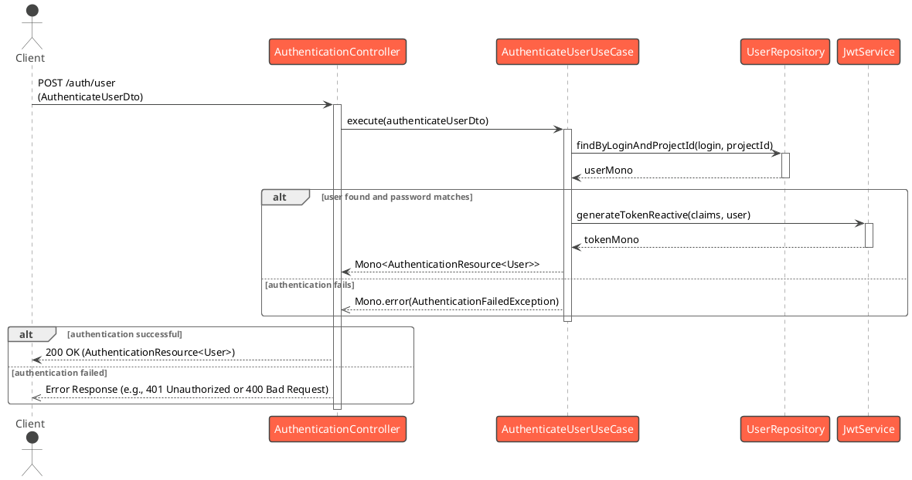
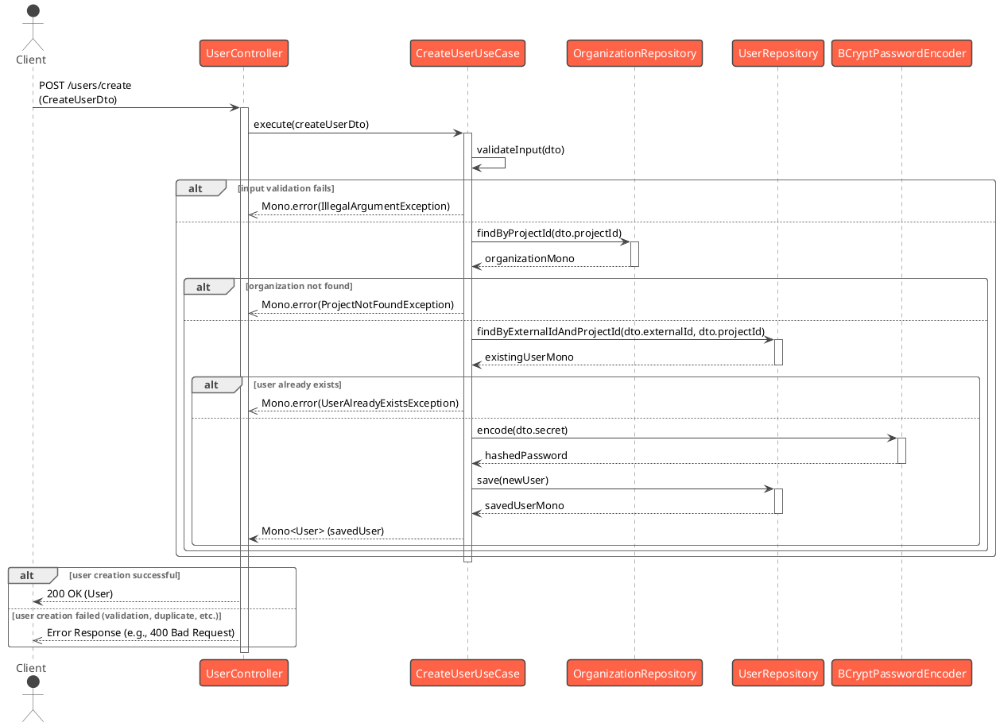
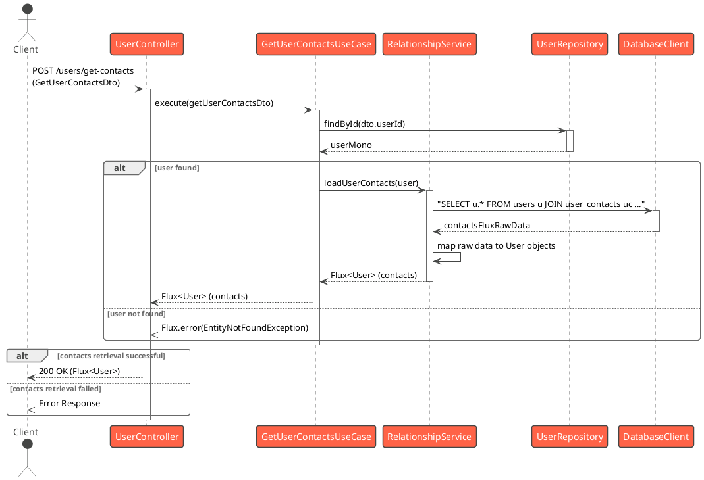
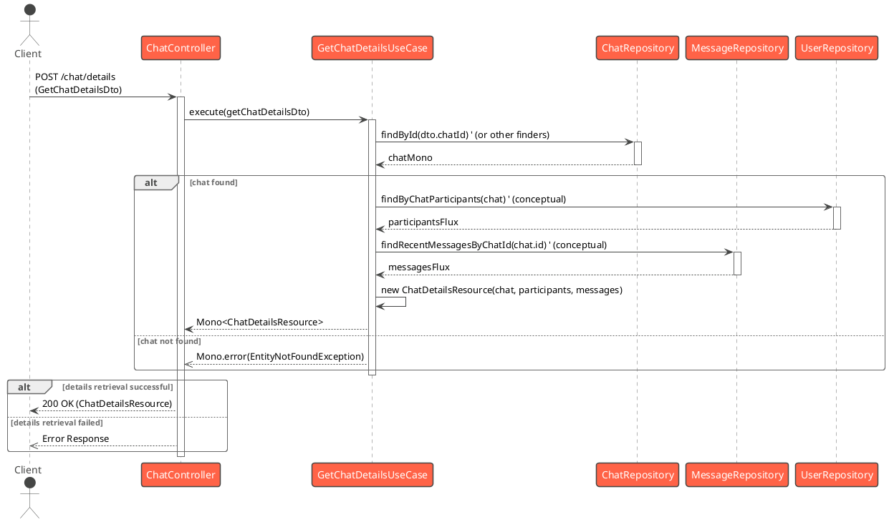

# Presentation Layer Documentation

This document provides an overview of the Presentation Layer of the Snappy Server application. This layer is responsible for handling incoming client requests (typically HTTP), delegating business logic to the Domain Layer (Use Cases), and returning responses to the client. It primarily consists of REST controllers.

---

## Controllers and API Endpoints

This section details the main controllers in the Presentation Layer and selected key API endpoints they expose.

---

### AuthenticationController

**Controller Overview:** `AuthenticationController` handles all authentication-related requests for the application. This includes endpoints for users and organizations to log in and receive authentication tokens.

#### Endpoint: User Authentication

*   **HTTP Method:** `POST`
*   **Path:** `/auth/user`
*   **Purpose:** Authenticates a user based on their credentials (login, secret, project ID) and returns an authentication token along with user details if successful.
*   **Request DTO:** `org.enspy.snappy.server.presentation.dto.authentication.AuthenticateUserDto`
    ```json
    {
      "login": "user_login_name",
      "secret": "user_password",
      "projectId": "project_identifier"
    }
    ```
*   **Response DTO:** `org.enspy.snappy.server.presentation.resources.AuthenticationResource<User>`
    ```json
    {
      "data": {
        // User entity fields (id, displayName, email, etc.)
      },
      "token": "jwt_token_string"
    }
    ```

**Sequence Diagram:**



**Diagram Explanation:**

1.  The **Client** sends a `POST` request to the `/auth/user` endpoint with `AuthenticateUserDto` (containing login, secret, and projectId) in the request body.
2.  The `AuthenticationController` receives the request and calls the `execute` method of the `AuthenticateUserUseCase`, passing the DTO.
3.  The `AuthenticateUserUseCase` then interacts with `UserRepository` to find the user by login and project ID.
4.  It verifies the provided secret (password) against the stored hashed password using `PasswordEncoder` (details omitted in this high-level diagram, but covered in Domain Layer docs).
5.  If the user is found and the password is correct, the use case calls `JwtService` to generate an authentication token.
6.  The `AuthenticateUserUseCase` returns an `AuthenticationResource` (containing the `User` details and the JWT) wrapped in a `Mono` to the `AuthenticationController`.
7.  If any step in the use case fails (e.g., user not found, password mismatch), it returns a `Mono.error`.
8.  The `AuthenticationController` maps the successful result to a `ResponseEntity.ok()` or handles the error by returning an appropriate HTTP error status (e.g., 401 for authentication failure, typically handled by global exception handlers).

*(Note: The endpoint `/auth/organization` follows a similar pattern with `AuthenticateOrganizationDto` and `AuthenticateOrganizationUseCase`.)*

---

### UserController

**Controller Overview:** `UserController` manages user-related operations, such as user creation, retrieval of user details and contacts, and user deletion.

#### Endpoint: Create User

*   **HTTP Method:** `POST`
*   **Path:** `/users/create`
*   **Purpose:** Creates a new user in the system.
*   **Request DTO:** `org.enspy.snappy.server.presentation.dto.user.CreateUserDto`
    ```json
    {
      "externalId": "unique_external_user_id",
      "displayName": "User Display Name",
      "login": "user_login",
      "secret": "user_password",
      "projectId": "associated_project_id",
      "avatar": "url_to_avatar.png", // Optional
      "email": "user@example.com",   // Optional
      "phoneNumber": "+1234567890",  // Optional
      "customJson": { "key": "value" } // Optional
    }
    ```
*   **Response DTO:** `org.enspy.snappy.server.domain.entities.User` (The created User entity)
    ```json
    {
      "id": "generated_uuid",
      "externalId": "unique_external_user_id",
      "displayName": "User Display Name",
      // ... other user fields ...
      "organizationId": "uuid_of_organization_linked_to_projectId"
    }
    ```

**Sequence Diagram:**



**Diagram Explanation:**

1.  The **Client** sends a `POST` request to `/users/create` with `CreateUserDto` in the body.
2.  `UserController` receives the request and calls `CreateUserUseCase.execute()` with the DTO.
3.  `CreateUserUseCase` first validates the input DTO.
4.  It then attempts to find the `Organization` based on `projectId` using `OrganizationRepository`.
5.  If the organization is found, it checks if a user with the given `externalId` and `projectId` already exists via `UserRepository`.
6.  If no existing user is found and organization exists, it hashes the provided `secret` (password) using `BCryptPasswordEncoder`.
7.  A new `User` entity is created, populated, and saved using `UserRepository`. The entire operation is typically transactional (as detailed in Domain Layer docs).
8.  The use case returns the saved `User` object in a `Mono`.
9.  If any step fails (validation, organization not found, user already exists), a `Mono.error` is returned.
10. `UserController` maps the successful result to `ResponseEntity.ok()` or handles errors appropriately.

---

#### Endpoint: Get User Contacts

*   **HTTP Method:** `POST`
*   **Path:** `/users/get-contacts`
*   **Purpose:** Retrieves the list of contacts for a specified user.
*   **Request DTO:** `org.enspy.snappy.server.presentation.dto.user.GetUserContactsDto`
    ```json
    {
      "userId": "user_id_for_whom_to_fetch_contacts",
      "projectId": "project_identifier"
    }
    ```
*   **Response DTO:** `Flux<org.enspy.snappy.server.domain.entities.User>` (A stream of User entities representing the contacts)
    ```json
    // Example of one User object in the Flux stream
    {
      "id": "contact_user_uuid",
      "displayName": "Contact Display Name",
      // ... other user fields ...
    }
    ```

**Sequence Diagram:**



**Diagram Explanation:**

1.  The **Client** sends a `POST` request to `/users/get-contacts` with `GetUserContactsDto` (containing `userId` and `projectId`) in the request body.
2.  The `UserController` receives the request and calls `GetUserContactsUseCase.execute()` with the DTO.
3.  The `GetUserContactsUseCase` would typically first verify the existence of the user for whom contacts are being requested (e.g., using `UserRepository.findById(dto.userId)`).
4.  To fetch the contacts, the use case might:
    *   Directly use `DatabaseClient` for a custom query involving a join with a `user_contacts` table (as indicated in the `RelationshipService.loadUserContacts` method, which this use case might leverage or replicate).
    *   Alternatively, it could delegate to a method in `RelationshipService` like `loadUserContacts(user)`.
5.  The raw contact data from the database is then mapped to `User` entities.
6.  The use case returns a `Flux<User>` emitting the contact User objects.
7.  If the primary user is not found or an error occurs, a `Flux.error` is returned.
8.  The `UserController` streams the `Flux<User>` back to the client as a JSON array.

*(Note: The exact internal implementation of `GetUserContactsUseCase` might vary, but the diagram shows a likely interaction pattern involving fetching the main user and then querying for their contacts, possibly via a service like `RelationshipService` or direct database access for custom relationship queries.)*

---

### ChatController

**Controller Overview:** `ChatController` is responsible for managing chat-related operations, including fetching chat details, listing a user's chats, sending messages, and modifying chat properties like the messaging mode.

#### Endpoint: Send Message

*   **HTTP Method:** `POST`
*   **Path:** `/chat/send`
*   **Purpose:** Sends a message from one user to another (or to a chatbot). Supports multipart/form-data for file attachments.
*   **Request DTO:** `org.enspy.snappy.server.presentation.dto.chat.SendMessageDto` (used as `@ModelAttribute` due to multipart)
    *   `senderId: String`
    *   `receiverId: String`
    *   `projectId: String`
    *   `body: String` (Text content of the message)
    *   `attachements: List<MultipartFile>` (Optional list of attached files)
*   **Response DTO:** `org.enspy.snappy.server.domain.entities.Message` (The sent Message entity)

**Sequence Diagram:**

```plantuml
@startuml
!theme vibrant
actor Client
participant ChatController as Controller
participant SendMessageUseCase as UseCase
participant UserRepository [[../domain_layer#user]]
participant MessageRepository [[../infrastructure_layer#repositories]]
participant SaveMessageAttachementUseCase [[../domain_layer#send-message]] ' (as part of SendMessageUseCase)

Client -> Controller : POST /chat/send \n(SendMessageDto as @ModelAttribute)
activate Controller

Controller -> UseCase : execute(sendMessageDto)
activate UseCase

' Detailed steps of SendMessageUseCase (e.g., find sender/receiver, save message, save attachments)
' are covered in its own Domain Layer documentation.
' Here, we show it as a single interaction for brevity at Presentation Layer.
UseCase -> UserRepository : findByExternalIdAndProjectId(senderId, projectId)
UseCase -> UserRepository : findByExternalIdAndProjectId(receiverId, projectId)
UseCase -> MessageRepository : save(newMessage)
opt if attachments present
  UseCase -> SaveMessageAttachementUseCase : execute(...)
end opt
' ... WebSocket notifications ...

UseCase --> Controller : Mono<Message> (sentMessage)
deactivate UseCase

alt message sending successful
  Controller --> Client : 200 OK (Message)
else message sending failed
  Controller -->> Client : Error Response
end
deactivate Controller
@enduml
```

**Diagram Explanation:**

1.  The **Client** sends a `POST` request to `/chat/send`. Since this endpoint consumes `multipart/form-data` (likely for file uploads), the `SendMessageDto` is populated from request parts/parameters.
2.  `ChatController` receives the request and calls `SendMessageUseCase.execute()` with the DTO.
3.  The `SendMessageUseCase` (as detailed in the Domain Layer documentation) handles:
    *   Fetching sender and receiver `User` entities.
    *   Creating and saving the `Message` entity.
    *   If attachments are present, calling `SaveMessageAttachementUseCase` to store them and link them to the message.
    *   Sending real-time notifications via WebSockets.
4.  The use case returns the persisted `Message` object in a `Mono`.
5.  `ChatController` maps the successful result to `ResponseEntity.ok()` containing the sent `Message`, or handles errors.

---

#### Endpoint: Get Chat Details

*   **HTTP Method:** `POST`
*   **Path:** `/chat/details`
*   **Purpose:** Retrieves detailed information about a specific chat session, including participant information and recent messages.
*   **Request DTO:** `org.enspy.snappy.server.presentation.dto.chat.GetChatDetailsDto`
    ```json
    {
      "chatId": "uuid_of_the_chat", // Or potentially senderId/receiverId pair
      "userId": "uuid_of_requesting_user", // To determine context if needed
      "projectId": "project_identifier"
    }
    ```
    *(Note: The exact fields in `GetChatDetailsDto` would need to be confirmed from its definition, as it's not shown in the controller snippet. Assuming it contains identifiers for the chat and possibly the user requesting details.)*
*   **Response DTO:** `org.enspy.snappy.server.presentation.resources.ChatDetailsResource`
    ```json
    // Structure of ChatDetailsResource would need to be inferred or found.
    // Likely contains:
    {
      "chat": { /* Chat entity details */ },
      "participants": [ { /* User entity details */ }, ... ],
      "messages": [ { /* Message entity details */ }, ... ]
    }
    ```

**Sequence Diagram:**



**Diagram Explanation:**

1.  The **Client** sends a `POST` request to `/chat/details` with `GetChatDetailsDto` in the request body. This DTO contains identifiers for the chat and possibly the requesting user.
2.  `ChatController` receives the request and calls `GetChatDetailsUseCase.execute()` with the DTO.
3.  The `GetChatDetailsUseCase` then orchestrates the fetching of data:
    *   It likely fetches the core `Chat` entity using `ChatRepository`.
    *   It fetches the participant `User` entities involved in the chat, possibly using `UserRepository` with information from the `Chat` entity.
    *   It fetches recent `Message` entities for the chat from `MessageRepository`.
4.  The use case assembles this information into a `ChatDetailsResource` object.
5.  If the chat or essential related data isn't found, the use case returns a `Mono.error`.
6.  `ChatController` maps the successful `ChatDetailsResource` to `ResponseEntity.ok()` or handles errors.

*(Note: The exact internal operations of `GetChatDetailsUseCase`, such as how it determines participants or fetches messages, are abstracted here but would be defined within that use case's logic.)*

---

### OrganizationController

**Controller Overview:** `OrganizationController` is responsible for managing organizations within the application. This includes creating new organizations, retrieving organization details, and deleting organizations.

#### Endpoint: Create Organization

*   **HTTP Method:** `POST`
*   **Path:** `/organizations`
*   **Purpose:** Creates a new organization. The response type `AuthenticationResource<Organization>` suggests that upon creation, an authentication token might also be returned for the newly created organization, allowing it to act as an authenticated principal.
*   **Request DTO:** `org.enspy.snappy.server.presentation.dto.organization.CreateOrganizationDto`
    ```json
    {
      "name": "New Organization Name",
      "email": "org_contact@example.com",
      "password": "org_admin_password",
      "projectId": "unique_project_id_for_org"
      // Any other fields required by CreateOrganizationDto
    }
    ```
*   **Response DTO:** `org.enspy.snappy.server.presentation.resources.AuthenticationResource<Organization>`
    ```json
    {
      "data": {
        // Organization entity fields (id, name, email, projectId, etc.)
      },
      "token": "jwt_token_string_for_organization"
    }
    ```

**Sequence Diagram:**

```plantuml
@startuml
!theme vibrant
actor Client
participant OrganizationController as Controller
participant CreateOrganizationUseCase as UseCase
participant OrganizationRepository [[../infrastructure_layer#repositories]]
participant PasswordEncoder [[../infrastructure_layer#securityconfig]] ' (from SecurityConfig)
participant JwtService [[../infrastructure_layer#jwtservice]]

Client -> Controller : POST /organizations \n(CreateOrganizationDto)
activate Controller

Controller -> UseCase : execute(createOrganizationDto)
activate UseCase

' CreateOrganizationUseCase internal logic (simplified here):
' - Validate DTO
' - Check for existing organization (e.g., by projectId or email)
UseCase -> OrganizationRepository : findByEmailOrProjectId(dto.email, dto.projectId) ' (conceptual)
activate OrganizationRepository
OrganizationRepository --> UseCase : existingOrgMono
deactivate OrganizationRepository

alt organization already exists
  UseCase -->> Controller : Mono.error(OrganizationAlreadyExistsException)
else
  UseCase -> PasswordEncoder : encode(dto.password)
  activate PasswordEncoder
  PasswordEncoder --> UseCase : hashedPassword
  deactivate PasswordEncoder
  UseCase -> OrganizationRepository : save(newOrganization)
  activate OrganizationRepository
  OrganizationRepository --> UseCase : savedOrganization
  deactivate OrganizationRepository
  ' Assuming CreateOrganizationUseCase also handles token generation for the new org
  UseCase -> JwtService : generateTokenReactive(claims, savedOrganization)
  activate JwtService
  JwtService --> UseCase : tokenMono
  deactivate JwtService
  UseCase -> UseCase : new AuthenticationResource(savedOrganization, token)
  UseCase --> Controller : Mono<AuthenticationResource<Organization>>
end
deactivate UseCase

alt creation successful
  Controller --> Client : 200 OK (AuthenticationResource<Organization>)
else creation failed
  Controller -->> Client : Error Response
end
deactivate Controller
@enduml
```

**Diagram Explanation:**

1.  The **Client** sends a `POST` request to `/organizations` with `CreateOrganizationDto` in the body.
2.  `OrganizationController` receives the request and calls `CreateOrganizationUseCase.execute()` with the DTO.
3.  The `CreateOrganizationUseCase` (whose detailed internal logic would be in the Domain Layer documentation) typically:
    *   Validates the input DTO.
    *   Checks if an organization with similar unique identifiers (e.g., email or `projectId`) already exists using `OrganizationRepository`.
    *   If no conflict, it hashes the provided password using a `PasswordEncoder`.
    *   Creates a new `Organization` entity, populates it, and saves it using `OrganizationRepository`.
    *   Since the response is `AuthenticationResource<Organization>`, the use case likely then generates a JWT for this new organization using `JwtService`.
    *   It wraps the saved `Organization` and the token into an `AuthenticationResource`.
4.  The use case returns this `AuthenticationResource` in a `Mono`.
5.  If any step fails (validation, duplicate organization), a `Mono.error` is returned.
6.  `OrganizationController` maps the successful result to `ResponseEntity.ok()` or handles errors.

---

#### Endpoint: Get Organization By ID

*   **HTTP Method:** `GET`
*   **Path:** `/organizations/{id}`
*   **Purpose:** Retrieves details of a specific organization by its unique ID.
*   **Request Parameters:**
    *   `id` (Path Variable): The UUID of the organization to retrieve.
*   **Response DTO:** `org.enspy.snappy.server.domain.entities.Organization`
    ```json
    {
      "id": "organization_uuid",
      "name": "Organization Name",
      "email": "org_contact@example.com",
      "projectId": "project_id_for_org"
      // ... other organization fields ...
    }
    ```

**Sequence Diagram:**

```plantuml
@startuml
!theme vibrant
actor Client
participant OrganizationController as Controller
participant GetOrganizationUseCase as UseCase
participant OrganizationRepository [[../infrastructure_layer#repositories]]
participant RelationshipService [[../infrastructure_layer#relationshipservice]] ' (optional enrichment)

Client -> Controller : GET /organizations/{id}
activate Controller

Controller -> UseCase : execute(id)
activate UseCase

UseCase -> OrganizationRepository : findById(id)
activate OrganizationRepository
OrganizationRepository --> UseCase : organizationMono
deactivate OrganizationRepository

alt organization found
  ' Optionally, the use case might enrich the organization with related data
  ' For example, loading users or chatbots belonging to the organization
  UseCase -> RelationshipService : loadOrganizationWithRelations(organization) ' (conceptual)
  activate RelationshipService
  RelationshipService --> UseCase : enrichedOrganizationMono
  deactivate RelationshipService
  UseCase --> Controller : Mono<Organization> (enrichedOrganization)
else organization not found
  UseCase -->> Controller : Mono.error(EntityNotFoundException) ' (or similar)
end
deactivate UseCase

alt retrieval successful
  Controller --> Client : 200 OK (Organization)
else retrieval failed (e.g., not found)
  Controller -->> Client : Error Response (e.g., 404 Not Found)
end
deactivate Controller
@enduml
```

**Diagram Explanation:**

1.  The **Client** sends a `GET` request to `/organizations/{id}`, where `{id}` is the UUID of the organization.
2.  `OrganizationController` receives the request and calls `GetOrganizationUseCase.execute()` with the `id`.
3.  The `GetOrganizationUseCase` calls `OrganizationRepository.findById()` to fetch the organization.
4.  (Optional) If the use case is designed to return a fully populated organization, it might then call `RelationshipService.loadOrganizationWithRelations()` to load associated entities like users or chatbots. This step is conceptual based on common patterns and the existence of `RelationshipService`.
5.  The use case returns the fetched (and possibly enriched) `Organization` object in a `Mono`.
6.  If the organization with the given ID is not found, `OrganizationRepository.findById()` would typically return an empty `Mono`, and the use case would propagate this or convert it to a `Mono.error` (e.g., with `EntityNotFoundException`).
7.  `OrganizationController` maps the successful result to `ResponseEntity.ok()` or handles errors (e.g., returning 404 if the organization is not found).

---

### ChatbotController

**Controller Overview:** `ChatbotController` handles operations related to chatbots, such as creating new chatbots, listing chatbots associated with a project, and retrieving available language models.

#### Endpoint: Create New Chatbot

*   **HTTP Method:** `POST`
*   **Path:** `/chatbot`
*   **Purpose:** Creates a new chatbot, potentially with attached files (e.g., for a knowledge base). It consumes `multipart/form-data` due to the `@ModelAttribute` usage, suitable for file uploads.
*   **Request DTO:** `org.enspy.snappy.server.presentation.dto.chatbot.CreateChatbotDto` (used as `@ModelAttribute`)
    *   `projectId: String`
    *   `label: String`
    *   `prompt: String`
    *   `description: String` (Optional)
    *   `languageModel: ChatbotLLM` (Enum)
    *   `attachements: List<MultipartFile>` (Optional list of files)
*   **Response DTO:** `org.enspy.snappy.server.domain.entities.Chatbot` (The created Chatbot entity)

**Sequence Diagram:**

```plantuml
@startuml
!theme vibrant
actor Client
participant ChatbotController as Controller
participant CreateChatbotUseCase as UseCase
participant OrganizationRepository [[../infrastructure_layer#repositories]]
participant ChatbotRepository [[../infrastructure_layer#repositories]]
participant SaveChatbotAttachementUseCase [[../domain_layer#create-chatbot]] ' (as part of CreateChatbotUseCase)
participant RelationshipService [[../infrastructure_layer#relationshipservice]]

Client -> Controller : POST /chatbot \n(CreateChatbotDto as @ModelAttribute)
activate Controller

Controller -> UseCase : execute(createChatbotDto)
activate UseCase

' CreateChatbotUseCase internal logic (simplified):
UseCase -> OrganizationRepository : findByProjectId(dto.projectId)
activate OrganizationRepository
OrganizationRepository --> UseCase : organizationMono
deactivate OrganizationRepository

alt organization found
  UseCase -> ChatbotRepository : save(newChatbot)
  activate ChatbotRepository
  ChatbotRepository --> UseCase : savedChatbot
  deactivate ChatbotRepository
  opt if attachments present
    UseCase -> SaveChatbotAttachementUseCase : execute(...)
  end opt
  UseCase -> RelationshipService : loadChatbotWithRelations(savedChatbot)
  activate RelationshipService
  RelationshipService --> UseCase : enrichedChatbot
  deactivate RelationshipService
  UseCase --> Controller : Mono<Chatbot> (enrichedChatbot)
else organization not found
  UseCase -->> Controller : Mono.error(IllegalArgumentException: "Project not found")
end
deactivate UseCase

alt creation successful
  Controller --> Client : 200 OK (Chatbot)
else creation failed
  Controller -->> Client : Error Response
end
deactivate Controller
@enduml
```

**Diagram Explanation:**

1.  The **Client** sends a `POST` request to `/chatbot`. Since the DTO `CreateChatbotDto` is annotated with `@ModelAttribute`, the request is typically `multipart/form-data`, allowing file uploads for `attachements`.
2.  `ChatbotController` receives the request and calls `CreateChatbotUseCase.execute()` with the DTO.
3.  The `CreateChatbotUseCase` (as detailed in the Domain Layer documentation) handles:
    *   Finding the parent `Organization` via `projectId`.
    *   Creating and saving the new `Chatbot` entity.
    *   Generating an access key.
    *   If attachments are provided, calling `SaveChatbotAttachementUseCase` to store them.
    *   Calling `RelationshipService` to load related data (like the `Organization` object) onto the `Chatbot` entity.
4.  The use case returns the persisted and potentially enriched `Chatbot` object in a `Mono`.
5.  `ChatbotController` maps the successful result to `ResponseEntity.ok()` containing the `Chatbot`, or handles errors.

---

#### Endpoint: Get Chatbots Related to Project

*   **HTTP Method:** `GET`
*   **Path:** `/chatbot/project-chatbot/{projectId}`
*   **Purpose:** Retrieves all chatbots that are associated with a specific project ID.
*   **Request Parameters:**
    *   `projectId` (Path Variable): The identifier of the project for which to fetch chatbots.
*   **Response DTO:** `Flux<org.enspy.snappy.server.domain.entities.Chatbot>` (A stream of Chatbot entities)

**Sequence Diagram:**

```plantuml
@startuml
!theme vibrant
actor Client
participant ChatbotController as Controller
participant GetChatbotsRelatedToProjectUseCase as UseCase
participant ChatbotRepository [[../infrastructure_layer#repositories]]
participant RelationshipService [[../infrastructure_layer#relationshipservice]] ' (conceptual for enrichment)

Client -> Controller : GET /chatbot/project-chatbot/{projectId}
activate Controller

Controller -> UseCase : execute(projectId)
activate UseCase

' GetChatbotsRelatedToProjectUseCase internal logic:
' It likely finds the organization by projectId first, then its chatbots, OR
' directly queries chatbots by projectId if Chatbot entity has projectId.
' Assuming Chatbot entity has a projectId field for direct lookup:
UseCase -> ChatbotRepository : findByProjectId(projectId)
activate ChatbotRepository
ChatbotRepository --> UseCase : chatbotsFlux
deactivate ChatbotRepository

' Optional: Enrichment of each chatbot in the flux
UseCase -> UseCase : enrich chatbots (e.g., with Organization, Attachments via RelationshipService)
' This would be a .flatMap(chatbot -> relationshipService.loadChatbotWithRelations(chatbot))
' For brevity, shown as a conceptual step.

UseCase --> Controller : Flux<Chatbot> (possibly enriched)
deactivate UseCase

Controller --> Client : 200 OK (Flux<Chatbot>)
deactivate Controller
@enduml
```

**Diagram Explanation:**

1.  The **Client** sends a `GET` request to `/chatbot/project-chatbot/{projectId}`, where `{projectId}` is the identifier for the project.
2.  `ChatbotController` receives the request and calls `GetChatbotsRelatedToProjectUseCase.execute()` with the `projectId`.
3.  The `GetChatbotsRelatedToProjectUseCase` likely interacts with `ChatbotRepository` to find all `Chatbot` entities that have a matching `projectId`. (The `Chatbot` entity does have a `projectId` field).
4.  Optionally, for each fetched chatbot, the use case might further enrich it by loading related data (e.g., its parent `Organization` or `ChatbotAttachements`) using `RelationshipService`. This would typically involve a `flatMap` operation on the flux of chatbots.
5.  The use case returns a `Flux<Chatbot>` containing all chatbots associated with the project, possibly with their relations loaded.
6.  `ChatbotController` streams this `Flux<Chatbot>` back to the client as a JSON array.

---

### SignalController

**Controller Overview:** `SignalController` manages operations related to the Signal Protocol, which is used for establishing end-to-end encrypted communication. These operations typically involve the registration and retrieval of pre-key bundles.

#### Endpoint: Register Pre-Key Bundle

*   **HTTP Method:** `POST`
*   **Path:** `/signal/pre-key-bundle/{userId}`
*   **Purpose:** Allows a client (identified by `userId`) to register its Signal Protocol pre-key bundle with the server. This bundle is then available for other users who wish to establish a secure session with this user.
*   **Request Parameters:**
    *   `userId` (Path Variable): The ID of the user registering the bundle.
*   **Request Body:** `org.enspy.snappy.server.domain.model.PreKeyBundle`
    ```json
    // Structure of PreKeyBundle (actual fields might vary based on Signal library)
    {
      "registrationId": 123,
      "identityKey": "base64_encoded_public_identity_key",
      "signedPreKey": {
        "keyId": 1,
        "publicKey": "base64_encoded_public_signed_prekey",
        "signature": "base64_encoded_signature_on_public_signed_prekey"
      },
      "oneTimePreKeys": [
        { "keyId": 101, "publicKey": "base64_encoded_onetime_prekey1" },
        { "keyId": 102, "publicKey": "base64_encoded_onetime_prekey2" }
        // ... more one-time pre-keys
      ]
    }
    ```
*   **Response:** `200 OK` (Empty body)

**Sequence Diagram:**

```plantuml
@startuml
!theme vibrant
actor Client
participant SignalController as Controller
participant RegisterPreKeyBundleUseCase as UseCase
' Assuming the use case interacts with some form of PreKeyBundleStore or Cache
participant PreKeyBundleStore as Store '(Conceptual)'

Client -> Controller : POST /signal/pre-key-bundle/{userId} \n(PreKeyBundle)
activate Controller

Controller -> Controller : new RegisterPreKeyBundleDto(userId, preKeyBundle)
Controller -> UseCase : execute(registerPreKeyBundleDto)
activate UseCase

' RegisterPreKeyBundleUseCase internal logic:
' - Validate bundle
' - Store the preKeyBundle associated with userId
UseCase -> Store : savePreKeyBundle(userId, preKeyBundle)
activate Store
Store --> UseCase : Mono<Void> (or success confirmation)
deactivate Store

UseCase --> Controller : Mono<Void>
deactivate UseCase

Controller --> Client : 200 OK
deactivate Controller
@enduml
```

**Diagram Explanation:**

1.  The **Client** (for user `userId`) sends a `POST` request to `/signal/pre-key-bundle/{userId}` with its `PreKeyBundle` data in the request body.
2.  `SignalController` receives the request, creates a `RegisterPreKeyBundleDto` containing the `userId` and `preKeyBundle`.
3.  It then calls `RegisterPreKeyBundleUseCase.execute()` with this DTO.
4.  The `RegisterPreKeyBundleUseCase` is responsible for validating the bundle (not shown in detail) and persisting it. This typically involves storing the bundle in a way that it can be retrieved later by other users who want to initiate a secure session with `userId` (e.g., in a database or a cache, represented here as `PreKeyBundleStore`).
5.  The use case returns a `Mono<Void>` to indicate completion.
6.  `SignalController` maps the successful completion to a `ResponseEntity.ok()` with an empty body.

---

#### Endpoint: Get Pre-Key Bundle

*   **HTTP Method:** `GET`
*   **Path:** `/signal/pre-key-bundle/{userId}`
*   **Purpose:** Retrieves the Signal Protocol pre-key bundle for a specified user (`userId`). This bundle is needed by another user to initiate an encrypted session with `userId`.
*   **Request Parameters:**
    *   `userId` (Path Variable): The ID of the user whose pre-key bundle is being requested.
*   **Response DTO:** `org.enspy.snappy.server.domain.model.PreKeyBundle` (The requested pre-key bundle)
    ```json
    // Same structure as the PreKeyBundle in the POST request
    {
      "registrationId": 123,
      "identityKey": "...",
      "signedPreKey": { ... },
      "oneTimePreKeys": [ ... ] // May only return one one-time key, or none if depleted
    }
    ```

**Sequence Diagram:**

```plantuml
@startuml
!theme vibrant
actor Client
participant SignalController as Controller
participant GetPreKeyBundleUseCase as UseCase
' Assuming the use case interacts with some form of PreKeyBundleStore or Cache
participant PreKeyBundleStore as Store '(Conceptual)'

Client -> Controller : GET /signal/pre-key-bundle/{userId}
activate Controller

Controller -> UseCase : execute(userId)
activate UseCase

' GetPreKeyBundleUseCase internal logic:
' - Retrieve the preKeyBundle for userId
' - Potentially select and mark a one-time pre-key as used
UseCase -> Store : getPreKeyBundleForUser(userId)
activate Store
Store --> UseCase : preKeyBundleMono
deactivate Store

UseCase --> Controller : Mono<PreKeyBundle>
deactivate UseCase

alt bundle found
  Controller --> Client : 200 OK (PreKeyBundle)
else bundle not found
  Controller -->> Client : Error Response (e.g., 404 Not Found)
end
deactivate Controller
@enduml
```

**Diagram Explanation:**

1.  The **Client** (wishing to communicate with `userId`) sends a `GET` request to `/signal/pre-key-bundle/{userId}`.
2.  `SignalController` receives the request and calls `GetPreKeyBundleUseCase.execute()` with the `userId`.
3.  The `GetPreKeyBundleUseCase` retrieves the pre-key bundle for the specified `userId` from the storage mechanism (represented as `PreKeyBundleStore`).
4.  An important part of handling pre-key bundles is managing one-time pre-keys. When a bundle is fetched, one of the `oneTimePreKeys` is typically selected, returned as part of the bundle, and then removed or marked as used from the store to prevent reuse. This detail is usually handled within the use case.
5.  The use case returns the `PreKeyBundle` (or a `Mono.error` if not found or an issue occurs).
6.  `SignalController` maps the successful result to `ResponseEntity.ok()` containing the `PreKeyBundle`, or handles errors (e.g., returning 404 if no bundle is available for the user).

---
